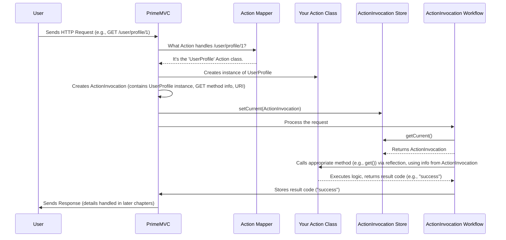

# Chapter 1: Action & ActionInvocation

Welcome to the Prime MVC tutorial! We're excited to guide you through building web applications with this powerful framework.

Imagine you're building a website, maybe a simple blog. When a user clicks a link like `/posts/view?id=123` or submits a form to create a new post at `/posts/create`, how does the web application know *what code to run*? How does it keep the logic for viewing posts separate from the logic for creating them?

This is where the concept of an **Action** comes in. It's the fundamental building block for handling requests in Prime MVC.

## What is an Action?

Think of your web application like a busy office. When a request comes in (like a customer asking for information), you need someone specific to handle it.

An **`Action`** in Prime MVC is like a dedicated **worker** (or a specific department) in that office. Each `Action` is a Java class responsible for handling requests for a particular URL or a pattern of URLs. Its job is to contain the application logic for that specific task.

*   **Example Task:** Showing a user's profile page.
*   **Example Task:** Saving changes to user settings.
*   **Example Task:** Displaying a list of blog posts.

You tell Prime MVC that a class is an Action by adding the `@Action` annotation to it.

```java
// Simple example of an Action class
package com.example.action;

import org.primeframework.mvc.action.annotation.Action;

@Action // This annotation marks this class as a Prime MVC Action
public class ViewUserProfile {
  // ... fields to hold user data would go here ...

  // Method to handle GET requests for this Action's URL
  public String get() {
    System.out.println("Logic to load user profile goes here!");
    // Load user data...
    return "success"; // Tells the framework what to do next
  }
}
```

In this simple example, the `ViewUserProfile` class is designated as an `Action`. It has a `get` method, which by convention often handles HTTP GET requests (like simply viewing a page). The actual logic to fetch user data would go inside this method.

## What is an ActionInvocation?

Now, imagine our office worker (the `Action`) needs specific instructions for *each individual task* they perform. Just knowing they work in the "Profile Viewing Department" isn't enough. For a *specific* request, they need to know:

*   Which *exact* user profile are we viewing right now (e.g., `/users/profile/123`)?
*   Was this a request to *view* the profile (GET) or *update* it (POST)?
*   What's the precise URL that was requested?

This is where **`ActionInvocation`** comes in. Think of it as the **work order** or **memo** for a *single, specific execution* of an Action.

An `ActionInvocation` object holds all the context and details needed for one particular request being handled by an `Action`. It contains:

1.  **The Action object itself:** The actual instance of our worker class (e.g., an instance of `ViewUserProfile`).
2.  **The Method to Call:** Which specific method inside the `Action` class should be executed (e.g., the `get` method for viewing, or maybe a `post` method for saving).
3.  **The Action URI:** The specific URL path that triggered this action (e.g., `/users/profile/123`).
4.  **URL Parameters:** Any parameters extracted from the URL itself.
5.  **Configuration:** Information about how the Action was configured.
6.  **Other Context:** More details about the current request processing state.

You generally don't create `ActionInvocation` objects yourself. The Prime MVC framework creates one for you *every time* a request comes in that maps to one of your `Action` classes.

## How They Work Together (The Big Picture)

1.  A user's browser sends a request to your server (e.g., `GET /users/profile/123`).
2.  Prime MVC receives the request.
3.  It figures out *which* `Action` class is responsible for the `/users/profile/123` URL. (We'll cover how it figures this out in [Chapter 2: Action Mapping (ActionMapper / ActionMappingWorkflow)](02_action_mapping__actionmapper___actionmappingworkflow__.md)). Let's say it determines the `ViewUserProfile` class is the one.
4.  Prime MVC creates an instance of the `ViewUserProfile` class.
5.  Prime MVC creates an `ActionInvocation` object, bundling together:
    *   The `ViewUserProfile` instance.
    *   Information that the `get` method should be called (because it was an HTTP GET request).
    *   The URI `/users/profile/123`.
    *   Any configuration associated with `ViewUserProfile`.
6.  Prime MVC then uses this `ActionInvocation` to actually *run* the `get` method on the `ViewUserProfile` instance.

This separation is key:

*   The `Action` focuses purely on your application's business logic.
*   The `ActionInvocation` carries the context for a specific request.
*   The Framework orchestrates the process of creating these and executing the logic.

## Under the Hood: A Glimpse

Let's peek behind the curtain a bit. You don't *need* to know these details to start, but understanding the internal pieces can be helpful later.

**Core Components:**

*   **`@Action` Annotation (`Action.java`):** This is just a marker. The framework scans your code for classes marked with `@Action` to discover potential workers.
    ```java
    // From: main/java/org/primeframework/mvc/action/annotation/Action.java
    @Retention(RetentionPolicy.RUNTIME)
    @Target(ElementType.TYPE)
    public @interface Action {
      // Defines attributes like URI patterns, security, etc.
      // We'll explore these attributes later.
      String value() default ""; // Used for URI patterns
      // ... other attributes ...
    }
    ```
    This annotation tells Prime MVC, "Hey, this class is an Action!".

*   **`ActionInvocation` Class (`ActionInvocation.java`):** This class is like the data structure for the "work order".
    ```java
    // From: main/java/org/primeframework/mvc/action/ActionInvocation.java
    public class ActionInvocation {
      public Object action; // The instance of your Action class
      public String actionURI; // The specific URI for this request
      public ActionConfiguration configuration; // Action's setup
      public ExecuteMethodConfiguration method; // Which method to run
      public boolean executeResult = true; // Should we process the result?
      // ... other fields like uriParameters, extension ...

      // Constructor used by the framework
      public ActionInvocation(Object action, ExecuteMethodConfiguration method,
                              String uri, String extension,
                              ActionConfiguration configuration) {
        // ... assigns values to fields ...
      }
      // ... another constructor ...
    }
    ```
    This holds all the important pieces of information about the specific request being processed.

*   **`ActionInvocationStore` (`ActionInvocationStore.java`):** How does the framework keep track of the *current* work order (`ActionInvocation`) while processing a request? It uses a store, often tied to the current web request. Think of it like a temporary clipboard.
    ```java
    // From: main/java/org/primeframework/mvc/action/ActionInvocationStore.java
    public interface ActionInvocationStore {
      // Gets the current ActionInvocation for this request
      ActionInvocation getCurrent();

      // Sets the current ActionInvocation for this request
      void setCurrent(ActionInvocation actionInvocation);

      // Removes the current one (e.g., after processing)
      void removeCurrent();

      // Provides access to the underlying stack (for advanced cases)
      Deque<ActionInvocation> getDeque();
    }
    ```
    The `DefaultActionInvocationStore` (seen in the provided code snippets) is a common implementation that uses the underlying `HTTPRequest` object to store this information.

*   **`ActionInvocationWorkflow` (`ActionInvocationWorkflow.java`):** This is the component that actually takes the `ActionInvocation` and executes the appropriate method on the `Action` object. It's part of the overall request processing pipeline. We'll learn more about workflows in [Chapter 4: Workflow & WorkflowChain](04_workflow___workflowchain__.md).
    ```java
    // From: main/java/org/primeframework/mvc/action/DefaultActionInvocationWorkflow.java
    public class DefaultActionInvocationWorkflow implements ActionInvocationWorkflow {
      // ... dependencies injected (like the store) ...

      public void perform(WorkflowChain chain) throws IOException {
        // 1. Get the current work order
        ActionInvocation actionInvocation = actionInvocationStore.getCurrent();

        if (actionInvocation.action != null) {
          // 2. Execute the appropriate method on the action object
          String resultCode = execute(actionInvocation);
          // 3. Store the result code (like "success")
          resultStore.set(resultCode);
        }

        // 4. Continue to the next step in the request processing
        chain.continueWorkflow();
      }

      protected String execute(ActionInvocation ai) {
        // Uses reflection to call the method (e.g., get()) on the action
        Object action = ai.action;
        String result = ReflectionUtils.invoke(ai.method.method, action);
        // ... error handling for null result ...
        return result;
      }
    }
    ```
    This workflow component gets the `ActionInvocation` from the store and then uses Java's reflection mechanism to call the correct method (like `get()` or `post()`) on your action object.

**Simplified Flow Diagram:**



Don't worry if the workflow and reflection parts seem complex right now. The key takeaway is that the framework uses the `ActionInvocation` as a bundle of instructions to execute the correct logic in your `Action` class.

## Conclusion

You've just learned about the most fundamental concepts in Prime MVC:

*   **Action:** A Java class (marked with `@Action`) containing the logic for a specific task or URL. It's your primary workspace.
*   **ActionInvocation:** An object holding the context (the Action instance, method to call, URI, etc.) for a *single* execution of an Action. It's the work order created by the framework for each relevant request.

Understanding this separation helps you organize your code effectively. You write the logic in Actions, and the framework handles the details of invoking them based on incoming requests using ActionInvocations.

But how does the framework know *which* Action corresponds to which URL? That's the job of Action Mapping, which we'll explore next.

**Next:** [Chapter 2: Action Mapping (ActionMapper / ActionMappingWorkflow)](02_action_mapping__actionmapper___actionmappingworkflow__.md)

---

Generated by [AI Codebase Knowledge Builder](https://github.com/The-Pocket/Tutorial-Codebase-Knowledge)