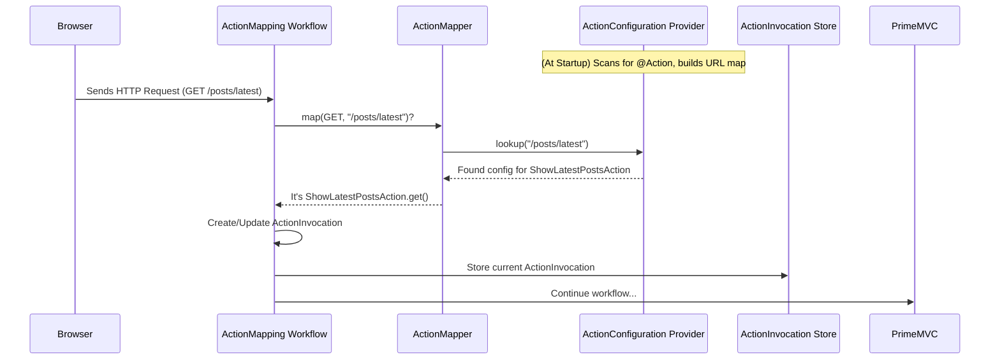

# Chapter 2: Action Mapping (ActionMapper / ActionMappingWorkflow)

In [Chapter 1: Action & ActionInvocation](01_action___actioninvocation_.md), we learned about `Action` classes – the workers that handle specific tasks in our web application – and the `ActionInvocation` – the work order for a single request.

But a big question remains: When a user types a URL like `http://myawesomeblog.com/posts/latest` into their browser, how does Prime MVC know *exactly which* `Action` worker class should handle that request? There could be many `Action` classes in our application!

This is where **Action Mapping** comes in. It's the crucial step of figuring out the correct worker for the job based on the address (URL) provided.

## The Problem: Connecting URLs to Code

Imagine our web application is like a large company with many different departments (our `Action` classes).

*   The "View Post" department handles showing blog posts.
*   The "Create Post" department handles saving new posts.
*   The "User Profile" department handles showing user information.

When a request comes in (like a letter addressed to `/posts/latest`), someone needs to look at the address and route it to the right department. Without this routing, the request would be lost, and the user wouldn't get the page they asked for.

## The Solution: ActionMapper and ActionMappingWorkflow

Prime MVC solves this routing problem using two main components:

1.  **`ActionMapper`**: Think of this as the **directory assistance operator** or the **receptionist** for your application. Its job is to take the incoming URL (e.g., `/posts/latest`) and the HTTP method (like GET for viewing, POST for submitting data) and look up which specific `Action` class and method inside that class should handle the request.
2.  **`ActionMappingWorkflow`**: This is like a specific **station on the request processing assembly line**. When a request comes into the application, it goes through several steps (a "workflow"). The `ActionMappingWorkflow` is the particular step *responsible for performing the action mapping*. It uses the `ActionMapper` to do the actual lookup. We'll learn more about the overall assembly line in [Chapter 4: Workflow & WorkflowChain](04_workflow___workflowchain__.md).

**How does the `ActionMapper` know the mappings?**

It usually figures them out in one of two ways:

*   **By Convention:** Prime MVC can be set up to automatically map URLs based on the package and class names of your `Action` classes. For example, an action class named `com.example.action.posts.LatestAction` might automatically handle the URL `/posts/latest`. This is often the easiest way to get started.
*   **By Explicit Configuration:** You can explicitly tell Prime MVC which URL an `Action` should handle using annotations directly on your `Action` class. This gives you more control.

Let's look at an example using the `@Action` annotation we saw briefly in Chapter 1:

```java
// src/main/java/com/example/action/ShowLatestPostsAction.java
package com.example.action;

import org.primeframework.mvc.action.annotation.Action;

// This annotation explicitly maps this Action to the URL "/posts/latest"
@Action("/posts/latest")
public class ShowLatestPostsAction {

  // This method handles GET requests to "/posts/latest"
  public String get() {
    System.out.println("Fetching the latest blog posts...");
    // ... logic to load posts from database ...
    return "success"; // We'll learn what this means later
  }
}
```

In this case, the `@Action("/posts/latest")` annotation tells the `ActionMapper` that any GET request for the URL `/posts/latest` should be handled by the `get()` method of the `ShowLatestPostsAction` class.

When a request for `/posts/latest` comes in:

1.  The request hits the `ActionMappingWorkflow` station on the assembly line.
2.  The `ActionMappingWorkflow` asks the `ActionMapper`, "Who handles GET for `/posts/latest`?"
3.  The `ActionMapper` (having scanned our code for `@Action` annotations earlier) replies, "That's the `get()` method in the `ShowLatestPostsAction` class!"
4.  The `ActionMappingWorkflow` then prepares the `ActionInvocation` (the work order) containing this information, so the framework knows exactly what code to run next.

## Under the Hood: How the Mapping Happens

You usually don't need to interact directly with the `ActionMapper` or `ActionMappingWorkflow` yourself. You just define your `Action` classes, and the framework takes care of the routing. But understanding the internal process can be helpful.

**Simplified Flow:**

1.  **Startup:** When your application starts, Prime MVC scans your code. An `ActionConfigurationProvider` finds all classes marked with `@Action`. It builds an internal directory or map connecting URL patterns to these `Action` classes.
2.  **Request Arrives:** A user requests a URL (e.g., `GET /posts/latest`).
3.  **Workflow:** The request enters the Prime MVC processing pipeline and reaches the `ActionMappingWorkflow`.
4.  **Lookup:** The `ActionMappingWorkflow` takes the request's URI (`/posts/latest`) and HTTP method (`GET`) and passes them to the `ActionMapper`.
5.  **Mapping:** The `ActionMapper` uses the internal directory (built at startup by the `ActionConfigurationProvider`) to find the matching `Action` (e.g., `ShowLatestPostsAction`) and the correct method (e.g., `get()`).
6.  **Invocation Prep:** The `ActionMapper` returns this information, often packaged partly into an `ActionInvocation` object.
7.  **Store & Continue:** The `ActionMappingWorkflow` stores this `ActionInvocation` (using the `ActionInvocationStore` from [Chapter 1: Action & ActionInvocation](01_action___actioninvocation_.md)) so other parts of the framework can access it. It then tells the pipeline to continue to the next step.



**Key Code Components:**

*   **`ActionMapper` Interface (`main/java/org/primeframework/mvc/action/ActionMapper.java`):** Defines the contract for the "directory assistance operator".

    ```java
    package org.primeframework.mvc.action;

    import io.fusionauth.http.HTTPMethod;

    public interface ActionMapper {
      // Takes method and URI, returns the "work order" info
      ActionInvocation map(HTTPMethod httpMethod, String uri, boolean executeResult);
    }
    ```
    The core method is `map`, which performs the lookup.

*   **`DefaultActionMapper` (`main/java/org/primeframework/mvc/action/DefaultActionMapper.java`):** The standard implementation.

    ```java
    package org.primeframework.mvc.action;

    // ... imports ...

    public class DefaultActionMapper implements ActionMapper {
      private final ActionConfigurationProvider actionConfigurationProvider;
      private final Injector injector; // Used to create Action instances

      @Inject // Dependencies provided automatically
      public DefaultActionMapper(ActionConfigurationProvider actionConfigurationProvider, Injector injector) {
        this.actionConfigurationProvider = actionConfigurationProvider;
        this.injector = injector;
      }

      @Override
      public ActionInvocation map(HTTPMethod httpMethod, String uri, boolean executeResult) {
        // 1. Ask the provider to find the configuration for the URI
        ActionInvocation invocation = actionConfigurationProvider.lookup(uri);

        // 2. If found, create an instance of the Action class
        if (invocation.configuration != null) {
          invocation.action = injector.getInstance(invocation.configuration.actionClass);
          // 3. Find the correct method (get, post, etc.) for the HTTP method
          invocation.method = invocation.configuration.executeMethods.get(httpMethod);
        }
        // ... logic for index pages (e.g., /posts/ -> /posts/index) ...
        return invocation; // Return the ActionInvocation (work order)
      }
    }
    ```
    This class uses the `ActionConfigurationProvider` to find the configuration and then prepares the `ActionInvocation`.

*   **`ActionConfigurationProvider` Interface (`main/java/org/primeframework/mvc/action/config/ActionConfigurationProvider.java`):** Defines how action configurations are found and retrieved.

    ```java
    package org.primeframework.mvc.action.config;

    // ... imports ...

    public interface ActionConfigurationProvider {
      // Finds the Action configuration details for a given URI
      ActionInvocation lookup(String uri);

      // (Can also list all known configurations)
      List<ActionConfiguration> getActionConfigurations();
    }
    ```
    The `lookup` method is used by the `ActionMapper`. The `DefaultActionConfigurationProvider` implementation (in `main/java/org/primeframework/mvc/action/config/DefaultActionConfigurationProvider.java`) is responsible for scanning classes with `@Action` annotations at startup.

*   **`ActionMappingWorkflow` Interface (`main/java/org/primeframework/mvc/action/ActionMappingWorkflow.java`):** Marks the workflow component responsible for mapping.

    ```java
    package org.primeframework.mvc.action;

    import org.primeframework.mvc.workflow.Workflow;

    // Just identifies this as a specific type of Workflow step
    public interface ActionMappingWorkflow extends Workflow {
    }
    ```

*   **`DefaultActionMappingWorkflow` (`main/java/org/primeframework/mvc/action/DefaultActionMappingWorkflow.java`):** The standard implementation of the mapping workflow step.

    ```java
    package org.primeframework.mvc.action;

    // ... imports ...

    public class DefaultActionMappingWorkflow implements ActionMappingWorkflow {
      private final ActionInvocationStore actionInvocationStore;
      private final ActionMapper actionMapper;
      private final HTTPRequest request; // Info about the incoming request
      // ... other dependencies ...

      @Inject
      public DefaultActionMappingWorkflow(HTTPRequest request, /*...,*/ ActionInvocationStore actionInvocationStore,
                                          ActionMapper actionMapper, /*...*/ ) {
        this.request = request;
        this.actionInvocationStore = actionInvocationStore;
        this.actionMapper = actionMapper;
        // ...
      }

      @Override
      public void perform(WorkflowChain chain) throws IOException {
        // 1. Figure out the URI from the request
        String uri = determineURI();
        HTTPMethod method = request.getMethod();

        // 2. Ask the ActionMapper to find the ActionInvocation
        ActionInvocation actionInvocation = actionMapper.map(method, uri, /*...*/);

        // 3. Store the result so other steps can use it
        actionInvocationStore.setCurrent(actionInvocation);

        // Handle cases where no method matches the HTTP verb (e.g., POST to a GET-only action)
        if (actionInvocation.action != null && actionInvocation.method == null) {
           throw new NotAllowedException(); // Or similar error
        }

        // 4. Continue to the next step in the assembly line
        chain.continueWorkflow();

        // Clean up after the request is processed further down the chain
        // (Error handling might keep it longer)
        actionInvocationStore.removeCurrent();
      }

      private String determineURI() {
        // Logic to get the clean URI path from the request
        // ... (uses HTTPTools.getRequestURI) ...
        return uri;
      }
    }
    ```
    This workflow orchestrates the process: it gets the request details, uses the `ActionMapper`, stores the result in the `ActionInvocationStore`, and passes control to the next workflow step using `chain.continueWorkflow()`.

## Conclusion

You've now seen how Prime MVC connects incoming web requests to your specific `Action` code!

*   **Action Mapping** is the process of routing a URL to an `Action`.
*   The **`ActionMapper`** acts like a directory assistance operator, looking up the correct `Action` based on the URL and HTTP method, using information gathered at startup.
*   The **`ActionMappingWorkflow`** is the specific step in the request processing pipeline where this mapping occurs.

At this point, the framework knows *which* `Action` class and *which* method to run. The next logical question is: what happens *after* our `Action` method runs and returns a result (like the `"success"` string we saw earlier)? How does that turn into an HTML page or some other response for the user? That's where Result Handling comes in.

**Next:** [Chapter 3: Result Handling (Result / ResultInvocationWorkflow)](03_result_handling__result___resultinvocationworkflow__.md)

---

Generated by [AI Codebase Knowledge Builder](https://github.com/The-Pocket/Tutorial-Codebase-Knowledge)