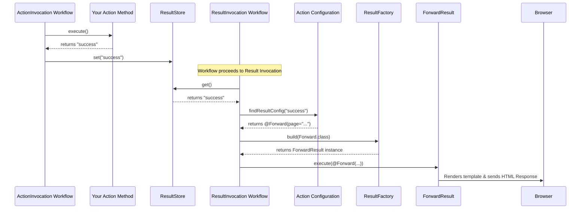

# Chapter 3: Result Handling (Result / ResultInvocationWorkflow)

Welcome back! In [Chapter 2: Action Mapping (ActionMapper / ActionMappingWorkflow)](02_action_mapping__actionmapper___actionmappingworkflow__.md), we saw how Prime MVC figures out which `Action` class and method should handle an incoming request based on the URL.

Now, let's think about what happens *after* your `Action` method finishes its work. Usually, your action method does something (like load data, save data) and then returns a simple string, often `"success"`.

```java
// From previous chapters...
@Action("/posts/latest")
public class ShowLatestPostsAction {

  public String get() {
    System.out.println("Fetching the latest blog posts...");
    // ... logic to load posts ...
    return "success"; // <--- What happens with this?
  }
}
```

But how does that simple string `"success"` magically turn into an HTML page displayed in the user's browser? Or maybe redirect the user to a different page? Or send back data in a format like JSON? This is the job of **Result Handling**.

## The Problem: From Code to Response

Imagine your `Action` is like a chef preparing a dish. When the dish is ready (the logic is done), the chef needs to tell the waiter (the framework) what to do with it. Just saying `"done"` isn't enough. Does it go on a fancy plate (HTML page)? Does it get boxed up for takeout (redirect)? Does it get listed on the menu specials board (JSON data)?

Your `Action` returns a **result code** (like `"success"`, `"error"`, `"input"`). This code is a signal about the outcome of the action's work. The **Result Handling** system takes this signal and translates it into the actual response sent back to the user's browser.

## Key Concepts: Result, Configuration, and Workflow

Prime MVC uses a few key pieces to manage this process:

1.  **`Result`**: This represents the *type* of response to generate. Think of it like the different ways a package can be handled in a shipping department:
    *   **`ForwardResult`**: Package it up with a presentation template (like a JSP or FreeMarker file) to create a full HTML page. This is very common for showing web pages.
    *   **`RedirectResult`**: Put a new address label on it and tell the delivery service (the browser) to go to that new address instead. Useful after saving data (e.g., redirecting from `/posts/create` to `/posts/view/123`).
    *   **`JSONResult`**: Package the data inside as raw JSON, often used for APIs or AJAX requests.
    *   **`StatusResult`**: Just send back a status code (like 200 OK, 404 Not Found, 500 Error) without any specific content. Useful for simple API acknowledgments or errors.
    *   *(Other types exist too, like `StreamResult` for sending files).*

2.  **Result Configuration**: How does the framework know which `Result` type (Forward, Redirect, etc.) to use for a specific result code (`"success"`, `"error"`) returned by your `Action`? You configure this, often using annotations directly on your `Action` class. It's like putting instructions on the chef's order ticket: "If dish is 'success', plate it using the 'fancy-plate.ftl' template."

3.  **`ResultInvocationWorkflow`**: This is the specific **assembly line station** responsible for handling the result. After your `Action` runs and produces a result code, the request processing moves to this workflow step. Its job is to:
    *   Look at the result code returned by the `Action`.
    *   Check the configuration to see which `Result` type is needed.
    *   Execute that `Result` to generate the final response.

## How to Use: Configuring Results

Let's make our `ShowLatestPostsAction` actually show an HTML page using a template.

**Step 1: Action returns a result code**

Our action already returns `"success"`.

```java
@Action("/posts/latest")
public class ShowLatestPostsAction {
  // Assume this list gets populated with blog posts
  public List<Post> posts;

  public String get() {
    System.out.println("Fetching the latest blog posts...");
    // posts = database.findLatestPosts(); // Load data into the 'posts' field
    return "success"; // Signal that everything went well
  }
}
```

**Step 2: Configure the Result using an annotation**

We need to tell Prime MVC what `"success"` means for this action. We'll use the `@Forward` annotation, which maps to the `ForwardResult`.

```java
// src/main/java/com/example/action/ShowLatestPostsAction.java
package com.example.action;

import org.primeframework.mvc.action.annotation.Action;
import org.primeframework.mvc.action.result.annotation.Forward; // Import annotation
import java.util.List;
// Assume Post class exists

@Action("/posts/latest")
// This annotation tells Prime MVC:
// If the action returns "success", use ForwardResult to show the template
// located at "/WEB-INF/templates/latest-posts.ftl"
@Forward(code = "success", page = "/WEB-INF/templates/latest-posts.ftl")
public class ShowLatestPostsAction {

  public List<Post> posts;

  public String get() {
    System.out.println("Fetching the latest blog posts...");
    // posts = database.findLatestPosts();
    // Make posts available to the template
    return "success";
  }

  // Example: What if loading failed?
  // public String get() {
  //   try {
  //     posts = database.findLatestPosts();
  //     return "success";
  //   } catch (DatabaseException e) {
  //     // Add error message
  //     return "error"; // Signal an error occurred
  //   }
  // }
  // You would then add another annotation like:
  // @Forward(code = "error", page = "/WEB-INF/templates/error-page.ftl")
}
```

**Step 3: Create the template (e.g., FreeMarker)**

Create the template file specified in the `@Forward` annotation. Prime MVC will automatically make the `Action` instance (and its public fields like `posts`) available to the template.

```html
<!-- /WEB-INF/templates/latest-posts.ftl -->
<!DOCTYPE html>
<html>
<head><title>Latest Posts</title></head>
<body>
  <h1>Latest Blog Posts</h1>
  <ul>
    <#-- Loop through the 'posts' field from the Action -->
    <#list posts as post>
      <li>${post.title}</li>
    </#list>
  </ul>
</body>
</html>
```

**What happens now?**

1.  User requests `/posts/latest`.
2.  [Action Mapping (ActionMapper / ActionMappingWorkflow)](02_action_mapping__actionmapper___actionmappingworkflow__.md) directs the request to `ShowLatestPostsAction.get()`.
3.  The `get()` method runs, loads posts, and returns `"success"`.
4.  The `ResultInvocationWorkflow` takes over.
5.  It sees the result code is `"success"`.
6.  It checks the annotations on `ShowLatestPostsAction` and finds `@Forward(code = "success", page = "/WEB-INF/templates/latest-posts.ftl")`.
7.  It knows it needs to use the `ForwardResult`.
8.  The `ForwardResult` is executed. It loads the `/WEB-INF/templates/latest-posts.ftl` template, processes it (using the `posts` data from the action), and sends the resulting HTML back to the user's browser.

You can add multiple result annotations to handle different outcomes (e.g., `@Forward` for `"success"`, `@Redirect` for `"saved"`, `@Forward` for `"error"`).

## Under the Hood: The Result Journey

Let's trace the journey of a result code internally.

1.  **Action Execution:** The `ActionInvocationWorkflow` (from [Chapter 1: Action & ActionInvocation](01_action___actioninvocation_.md)) executes your action method (e.g., `get()`).
2.  **Store Result Code:** The result string (e.g., `"success"`) is stored in the `ResultStore`. This is often a simple place, like a `ThreadLocal`, ensuring the code is available for the current request.
3.  **Workflow Continues:** The request processing pipeline moves to the next step, which is typically the `ResultInvocationWorkflow`.
4.  **Get Action & Code:** The `ResultInvocationWorkflow` retrieves the current `ActionInvocation` (which contains details about the action that just ran, including its configuration) and the result code from the `ResultStore`.
5.  **Lookup Result Config:** It looks inside the `ActionInvocation`'s `configuration` to find the result annotation associated with the retrieved code (`"success"`). Let's say it finds our `@Forward(code = "success", page = "...")` annotation.
6.  **Get Result Instance:** It determines the *type* of annotation (`@Forward`). It uses the `ResultFactory` to get an instance of the corresponding `Result` implementation (e.g., `ForwardResult`). The `ResultFactory` knows which implementation class corresponds to which annotation type (this mapping is set up during application startup, often via `ResultModule`).
7.  **Execute Result:** The `ResultInvocationWorkflow` calls the `execute` method on the obtained `Result` instance (e.g., `forwardResult.execute(forwardAnnotation)`), passing the specific annotation details (like the page path).
8.  **Generate Response:** The `Result` implementation (e.g., `ForwardResult`) does its job – finding the template, rendering it with action data, and writing the output to the HTTP response stream.

Here's a simplified diagram:



**Key Code Components:**

*   **`Result` Interface (`main/java/org/primeframework/mvc/action/result/Result.java`):** The contract for all result types.

    ```java
    package org.primeframework.mvc.action.result;

    // ... imports ...

    // T is the type of annotation this Result handles (e.g., @Forward)
    public interface Result<T extends Annotation> {
      /**
       * Executes the result.
       * @param annotation The specific annotation instance from the Action class.
       * @return true if the result was handled, false if not.
       * @throws IOException If sending the response fails.
       */
      boolean execute(T annotation) throws IOException;
    }
    ```
    The `execute` method is the core, performing the actual work of generating the response.

*   **Result Annotations (e.g., `main/java/org/primeframework/mvc/action/result/annotation/Forward.java`):** Define the configuration options for specific result types. They are marked with `@ResultAnnotation`.

    ```java
    package org.primeframework.mvc.action.result.annotation;
    // ... imports ...

    @ResultAnnotation // Marks this as a result configuration annotation
    @Retention(RetentionPolicy.RUNTIME)
    @Target(ElementType.TYPE) // Usually applied to the Action class
    public @interface Forward {
      String code() default "success"; // The result code this applies to
      String page(); // The template path (required)
      // ... other options like status code ...
    }
    ```
    These annotations hold the *configuration* data.

*   **`ResultStore` (`main/java/org/primeframework/mvc/action/result/ResultStore.java`):** Simple interface to store and retrieve the result code for the current request.

    ```java
    package org.primeframework.mvc.action.result;

    public interface ResultStore {
      String get(); // Get the code returned by the action
      void set(String resultCode); // Store the code
      void clear(); // Clean up
    }
    ```
    `ThreadLocalResultStore` is a common implementation using a `ThreadLocal`.

*   **`ResultFactory` (`main/java/org/primeframework/mvc/action/result/ResultFactory.java`):** Responsible for creating instances of `Result` implementations based on annotation types.

    ```java
    package org.primeframework.mvc.action.result;
    // ... imports ...
    public class ResultFactory {
      // Map<Annotation Type, Result Implementation Type>
      private final static Map<Class<? extends Annotation>, Class<? extends Result<?>>> bindings = new HashMap<>();
      private final Injector injector; // Used to create instances

      // Called at startup (by ResultModule) to register mappings
      public static <T extends Annotation> void addResult(Binder binder, Class<T> annotationType, Class<? extends Result<T>> resultType) {
        // ... registers the binding ...
      }

      // Called by ResultInvocationWorkflow to get a Result instance
      public Result<? extends Annotation> build(Class<? extends Annotation> annotationType) {
        return injector.getInstance(bindings.get(annotationType));
      }
    }
    ```
    This factory acts as a lookup service to get the correct `Result` object to execute.

*   **`ResultInvocationWorkflow` (`main/java/org/primeframework/mvc/action/result/DefaultResultInvocationWorkflow.java`):** Orchestrates the result handling process.

    ```java
    package org.primeframework.mvc.action.result;
    // ... imports ...
    public class DefaultResultInvocationWorkflow implements ResultInvocationWorkflow {
      private final ActionInvocationStore actionInvocationStore;
      private final ResultStore resultStore;
      private final ResultFactory factory;
      // ... other dependencies ...

      public void perform(WorkflowChain chain) throws IOException {
        ActionInvocation actionInvocation = actionInvocationStore.getCurrent();
        if (actionInvocation.executeResult) { // Check if result processing is needed
          Annotation annotation = null;
          String resultCode = "success"; // Default if action is null or doesn't return code

          if (actionInvocation.action != null) {
            resultCode = resultStore.get(); // Get code from store
            // Find the configured annotation for this result code
            annotation = actionInvocation.configuration.resultConfigurations.get(resultCode);
          }

          // If no specific annotation found, maybe default to a forward?
          if (annotation == null) {
             annotation = new ForwardImpl("", resultCode); // Default behavior
          }

          // ... (Pre-render method calls) ...

          // Get the Result implementation instance using the factory
          Result result = factory.build(annotation.annotationType());

          // Execute the result!
          boolean handled = result.execute(annotation);

          // If result wasn't handled (e.g., template not found), maybe try something else or let it become a 404
          if (!handled) {
             handleContinueOrRedirect(chain); // Or let it fall through
          }
        }
         // Note: In the real code, chain.continueWorkflow() might be called
         // if !handled or if result execution itself decides to pass through.
         // The provided code implicitly stops if handled, or tries a redirect/continues if not.
      }
      // ... helper methods ...
    }
    ```
    This workflow ties everything together: gets the code, finds the config, gets the `Result` object, and executes it.

## Conclusion

You've now learned how Prime MVC translates the simple string result code returned by your `Action` into a meaningful response for the user!

*   **`Action` methods** return **result codes** (like `"success"`) to signal the outcome.
*   **`Result` types** (like `ForwardResult`, `RedirectResult`) define *how* to generate the response.
*   **Result Configuration** (often via annotations like `@Forward` on the `Action`) links result codes to specific `Result` types and their parameters (like the template page).
*   The **`ResultInvocationWorkflow`** orchestrates this process, finding the right configuration and executing the appropriate `Result` implementation.

This mechanism provides a clean separation between your action's business logic and the presentation or response generation logic.

So far, we've seen individual steps: mapping a request to an action, executing the action, and handling the result. But how do these steps (and others) fit together in the overall request processing pipeline? That's where the concept of Workflows comes in.

**Next:** [Chapter 4: Workflow & WorkflowChain](04_workflow___workflowchain__.md)

---

Generated by [AI Codebase Knowledge Builder](https://github.com/The-Pocket/Tutorial-Codebase-Knowledge)