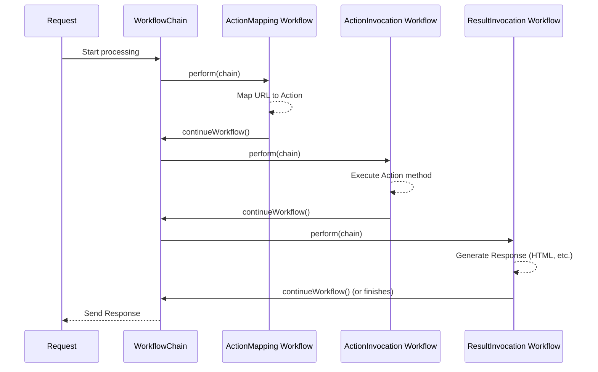

# Chapter 4: Workflow & WorkflowChain

In [Chapter 3: Result Handling (Result / ResultInvocationWorkflow)](03_result_handling__result___resultinvocationworkflow__.md), we saw how Prime MVC takes the result code from your `Action` (like `"success"`) and turns it into a response for the user, such as displaying an HTML page.

We've now seen several distinct steps in handling a web request:
1.  Mapping the URL to an `Action` ([Chapter 2: Action Mapping (ActionMapper / ActionMappingWorkflow)](02_action_mapping__actionmapper___actionmappingworkflow__.md)).
2.  Executing the `Action` method itself ([Chapter 1: Action & ActionInvocation](01_action___actioninvocation_.md)).
3.  Handling the result returned by the `Action` ([Chapter 3: Result Handling (Result / ResultInvocationWorkflow)](03_result_handling__result___resultinvocationworkflow__.md)).

But how does Prime MVC ensure these steps (and potentially others, like security checks or loading request data) happen in the *correct order*? And how does it manage the flow from one step to the next?

## The Problem: Orchestrating Request Processing

Imagine building a car on an assembly line. Each step needs to happen in a specific sequence: first the frame, then the engine, then the body, then the paint, etc. You can't paint the car before the body is attached!

Similarly, when processing a web request, there's a natural order:
*   You need to know *which* action to run before you can run it.
*   You need to run the action before you know its result.
*   You might need to check security *before* running the action.
*   You might need to load data from the request *before* the action needs it.

How do we manage this sequence of tasks reliably for every single request?

## The Solution: Workflows and WorkflowChains - The Assembly Line

Prime MVC uses the concept of **Workflows** and **WorkflowChains** to manage this process. Think of it exactly like that car assembly line:

1.  **`Workflow`**: This is a single, specific **station** on the assembly line. Each `Workflow` component has one specific job to do during request processing.
    *   Example Station: Check security credentials (`SecurityWorkflow`).
    *   Example Station: Figure out which `Action` matches the URL (`ActionMappingWorkflow`).
    *   Example Station: Load data from the request URL into the `Action` (`ParameterWorkflow`).
    *   Example Station: Run the actual `Action` method (`ActionInvocationWorkflow`).
    *   Example Station: Generate the final response based on the result code (`ResultInvocationWorkflow`).

2.  **`WorkflowChain`**: This is the **conveyor belt** that moves the request from one station (`Workflow`) to the next in the correct order. It ensures that each `Workflow` gets its turn to perform its task.

**How it Works:**

When a request comes in, it's placed on the `WorkflowChain` conveyor belt.
1.  The chain moves the request to the *first* `Workflow` station.
2.  That `Workflow` does its job (e.g., security check).
3.  When it's finished, the `Workflow` tells the `WorkflowChain`, "Okay, I'm done, move the request to the next station." It does this by calling a method usually named `continueWorkflow()`.
4.  The `WorkflowChain` then moves the request to the *next* `Workflow` station in the sequence.
5.  This continues until the request has passed through all the necessary stations on the assembly line.

This design keeps each step nicely separated. The `SecurityWorkflow` doesn't need to know how `Action` mapping works, it just does its security job and passes control. The `ActionMappingWorkflow` doesn't worry about running the action, it just finds the right one and passes control.

**Customization:**

While Prime MVC comes with a standard, sensible assembly line (order of workflows), developers can potentially customize it by adding their own custom `Workflow` stations or even (carefully) rearranging the order for advanced scenarios.

## Under the Hood: Following the Chain

Let's trace a request through a simplified workflow.

**Step-by-Step:**

1.  A request arrives (e.g., `GET /user/profile`).
2.  Prime MVC starts the main `WorkflowChain`.
3.  The Chain invokes the first `Workflow`, let's say `ActionMappingWorkflow`.
4.  `ActionMappingWorkflow` figures out that `/user/profile` maps to the `UserProfile` action's `get` method. It stores this information (as seen in [Chapter 2: Action Mapping (ActionMapper / ActionMappingWorkflow)](02_action_mapping__actionmapper___actionmappingworkflow__.md)).
5.  `ActionMappingWorkflow` calls `chain.continueWorkflow()`.
6.  The Chain invokes the next `Workflow`, maybe `ParameterWorkflow`.
7.  `ParameterWorkflow` loads any data needed by the action from the request.
8.  `ParameterWorkflow` calls `chain.continueWorkflow()`.
9.  The Chain invokes the next `Workflow`, `ActionInvocationWorkflow`.
10. `ActionInvocationWorkflow` runs the `UserProfile.get()` method (as seen in [Chapter 1: Action & ActionInvocation](01_action___actioninvocation_.md)). Let's say it returns `"success"`.
11. `ActionInvocationWorkflow` calls `chain.continueWorkflow()`.
12. The Chain invokes the next `Workflow`, `ResultInvocationWorkflow`.
13. `ResultInvocationWorkflow` takes the `"success"` code, finds the matching result configuration (e.g., show `profile.ftl`), and generates the HTML response (as seen in [Chapter 3: Result Handling (Result / ResultInvocationWorkflow)](03_result_handling__result___resultinvocationworkflow__.md)).
14. `ResultInvocationWorkflow` might call `chain.continueWorkflow()` or might finish the response directly.
15. The process completes.

**Diagram:**



**Key Code Components:**

*   **`Workflow` Interface (`main/java/org/primeframework/mvc/workflow/Workflow.java`):** This is the contract for every station on the assembly line.

    ```java
    package org.primeframework.mvc.workflow;

    import java.io.IOException;

    // Defines a single step (station) in the request processing
    public interface Workflow {
      /**
       * Performs the task for this workflow step.
       * @param workflowChain The conveyor belt, used to pass control next.
       */
      void perform(WorkflowChain workflowChain) throws IOException;
    }
    ```
    Any class implementing this interface can be a step in the request processing. Its `perform` method contains the logic for that specific step.

*   **`WorkflowChain` Interface (`main/java/org/primeframework/mvc/workflow/WorkflowChain.java`):** This is the contract for the conveyor belt.

    ```java
    package org.primeframework.mvc.workflow;

    import java.io.IOException;

    // Defines the conveyor belt mechanism
    public interface WorkflowChain {
      /**
       * Tells the chain to invoke the next Workflow station.
       */
      void continueWorkflow() throws IOException;
    }
    ```
    When a `Workflow` calls `continueWorkflow()`, the chain implementation is responsible for finding and invoking the *next* `Workflow` in the sequence.

*   **`DefaultMVCWorkflow` (`main/java/org/primeframework/mvc/workflow/DefaultMVCWorkflow.java`):** This class often represents the main entry point and holds the entire list of standard workflows.

    ```java
    public class DefaultMVCWorkflow implements MVCWorkflow { // MVCWorkflow extends Workflow
      private final List<Workflow> workflows; // Holds the ordered list of stations
      private final ErrorWorkflow errorWorkflow; // Special workflow for errors
      private final ExceptionHandler exceptionHandler; // Handles exceptions
      private final HTTPResponse response; // Used for error checking

      @Inject // Dependencies are provided automatically
      public DefaultMVCWorkflow(
          // Many different Workflow types are injected here...
          ActionMappingWorkflow actionMappingWorkflow,
          ParameterWorkflow parameterWorkflow,
          ActionInvocationWorkflow actionInvocationWorkflow,
          ResultInvocationWorkflow resultInvocationWorkflow,
          // ... and others like Security, Scopes, etc. ...
          ErrorWorkflow errorWorkflow,
          ExceptionHandler exceptionHandler,
          HTTPResponse response) {

        // Store the injected workflows in a specific order
        this.workflows = List.of(
            actionMappingWorkflow, // Station 1
            parameterWorkflow,   // Station 2
            actionInvocationWorkflow, // Station 3
            resultInvocationWorkflow, // Station 4
            // ... other standard workflows ...
        );
        this.errorWorkflow = errorWorkflow;
        this.exceptionHandler = exceptionHandler;
        this.response = response;
      }

      @Override
      public void perform(WorkflowChain workflowChain) throws IOException {
        try {
          // Create a chain for our list of workflows and start it
          WorkflowChain chain = new SubWorkflowChain(workflows, workflowChain);
          chain.continueWorkflow();
        } catch (RuntimeException | Error e) {
          // Handle errors using the exception handler and error workflow
          if (response.isCommitted()) { throw e; } // Too late if response started
          exceptionHandler.handle(e);
          // Run a special error processing workflow
          new SubWorkflowChain(List.of(errorWorkflow), workflowChain).continueWorkflow();
        }
      }
    }
    ```
    This class shows how a standard sequence of `Workflow`s (like `ActionMappingWorkflow`, `ActionInvocationWorkflow`, etc.) is assembled into a list. When its `perform` method is called, it creates a `WorkflowChain` (using `SubWorkflowChain`) for this list and starts the process by calling `continueWorkflow()` on that chain. It also includes basic error handling logic.

*   **`SubWorkflowChain` (`main/java/org/primeframework/mvc/workflow/SubWorkflowChain.java`):** A common implementation of the `WorkflowChain`.

    ```java
    public class SubWorkflowChain implements WorkflowChain {
      private final Iterator<Workflow> iterator; // Keeps track of where we are
      private final WorkflowChain outer; // Allows nesting chains (optional)

      // Creates a chain for a given list of workflows
      public SubWorkflowChain(Iterable<Workflow> workflows, WorkflowChain outer) {
        this.iterator = workflows.iterator();
        this.outer = outer;
      }

      @Override
      public void continueWorkflow() throws IOException {
        if (iterator.hasNext()) { // Is there another station on our list?
          // Yes, get the next workflow station
          Workflow workflow = iterator.next();
          // Tell that station to do its job, passing 'this' chain
          // so it can call continueWorkflow() when done.
          workflow.perform(this);
        } else {
          // No more stations in our list.
          // If we are part of a larger chain, continue that one.
          if (outer != null) {
            outer.continueWorkflow();
          }
          // Otherwise, this part of the assembly line is finished.
        }
      }
    }
    ```
    This implementation manages iterating through the list of `Workflow`s. Each time `continueWorkflow` is called, it checks if there's another `Workflow` in its list. If yes, it calls `perform` on that next `Workflow`. If not, the chain segment is complete.

## Conclusion

You've learned about the core mechanism Prime MVC uses to manage the sequence of operations for handling a web request:

*   **`Workflow`**: Represents a single, distinct step or task (a station) in the request processing pipeline. Examples include mapping actions, invoking actions, and handling results.
*   **`WorkflowChain`**: Represents the ordered sequence (the conveyor belt) that executes `Workflow`s one after another. Each `Workflow` performs its task and then calls `continueWorkflow()` on the chain to pass control to the next step.

This "assembly line" pattern provides a structured and extensible way to handle requests. Each part of the process is encapsulated in its own `Workflow`, making the system easier to understand, maintain, and potentially customize.

Many workflows need to interact with the data sent in the request (like form fields or values in the URL). How does Prime MVC extract this data and make it available to your `Action`? That's the focus of our next chapter.

**Next:** [Chapter 5: Parameter Handling (ParameterWorkflow / ExpressionEvaluator)](05_parameter_handling__parameterworkflow___expressionevaluator__.md)

---

Generated by [AI Codebase Knowledge Builder](https://github.com/The-Pocket/Tutorial-Codebase-Knowledge)