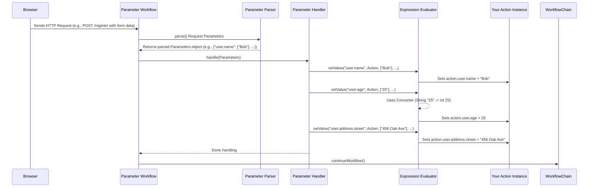

# Chapter 5: Parameter Handling (ParameterWorkflow / ExpressionEvaluator)

In [Chapter 4: Workflow & WorkflowChain](04_workflow___workflowchain__.md), we learned how Prime MVC uses an "assembly line" (`WorkflowChain`) with different "stations" (`Workflow`) to process a web request in an orderly fashion. We saw stations for mapping requests, running actions, and handling results.

But how does data submitted by a user actually get *into* our `Action` class so we can use it? Imagine a user filling out a registration form with their name and email. When they click "Submit", the browser sends this information to our server. How does Prime MVC take that `name=Alice` and `email=alice@example.com` from the request and put it into the corresponding fields in our `UserRegistrationAction` class?

This is the job of **Parameter Handling**.

## The Problem: Getting Data from the Request into Your Action

Think about a simple web form:

```html
<form action="/register" method="post">
  Name: <input type="text" name="user.name" /> <br/>
  Age:  <input type="text" name="user.age" /> <br/>
  Street: <input type="text" name="user.address.street" /> <br/>
  <button type="submit">Register</button>
</form>
```

When this form is submitted, the browser sends data like:
`user.name=Bob&user.age=25&user.address.street=456+Oak+Ave`

We might have an `Action` class like this:

```java
// Simplified Action class
@Action("/register")
public class UserRegistrationAction {
  public UserData user; // A nested object!

  // We need the form data to end up here!
  public String post() {
    System.out.println("Registering user: " + user.name);
    System.out.println("Age: " + user.age);
    System.out.println("Street: " + user.address.street);
    // ... save user logic ...
    return "success";
  }
}

// Helper classes
public class UserData {
  public String name;
  public int age; // Note: This is an integer!
  public AddressData address;
}

public class AddressData {
  public String street;
}
```

How does the framework bridge the gap between the raw text data (`user.name=Bob`, `user.age=25`) in the request and the structured fields (`user.name`, `user.age`) inside our `UserRegistrationAction`, even handling nested objects (`user.address.street`) and converting types (String `"25"` to integer `25`)?

## The Solution: ParameterWorkflow, ExpressionEvaluator, and Converters

Prime MVC handles this automatically using several components working together within the request processing pipeline:

1.  **`ParameterWorkflow`**: This is the specific **assembly line station** ([Workflow](04_workflow___workflowchain__.md)) dedicated to handling request parameters. It orchestrates the process of getting data from the request into your `Action`. It's usually part of the standard `WorkflowChain`.

2.  **`ParameterParser`**: Inside the `ParameterWorkflow`, this component acts like an **intake clerk**. Its job is to read all the parameters sent with the HTTP request (from the URL query string or the submitted form data) and sort them into categories.

3.  **`ParameterHandler`**: After the `ParameterParser` sorts the parameters, this component takes them and actually *puts* the values into the correct places in your `Action` object instance.

4.  **`ExpressionEvaluator`**: This is the "smart data entry clerk" used by the `ParameterHandler`. It understands the parameter names, which can be complex expressions like `user.address.street`. It knows how to navigate through your `Action` object and its nested objects (`user`, then `address`) to find the exact field (`street`) where the value should be placed.

5.  **`Converter`s**: The `ExpressionEvaluator` uses helpers called `Converter`s when the data types don't match. When it sees the request parameter `user.age=25` (which is a String) needs to go into an `int age` field, it asks the appropriate `Converter` to change the String `"25"` into the integer `25`.

**The Flow:**

When a request with parameters arrives:
1.  It goes through the standard `WorkflowChain`.
2.  It reaches the `ParameterWorkflow` station.
3.  The `ParameterWorkflow` uses the `ParameterParser` to read and organize the request parameters (e.g., `user.name="Bob"`, `user.age="25"`, `user.address.street="456 Oak Ave"`).
4.  The `ParameterWorkflow` passes these organized parameters to the `ParameterHandler`.
5.  The `ParameterHandler` takes each parameter one by one.
6.  For `user.name="Bob"`, it asks the `ExpressionEvaluator` to set the value `"Bob"` for the expression `"user.name"` on the `Action` object. The `ExpressionEvaluator` finds the `user` field, then the `name` field within that, and sets its value.
7.  For `user.age="25"`, it asks the `ExpressionEvaluator` to set the value `"25"` for the expression `"user.age"`. The `ExpressionEvaluator` sees the target field is an `int`. It uses a `Converter` to change `"25"` to `25` and then sets the integer value.
8.  For `user.address.street="456 Oak Ave"`, the `ExpressionEvaluator` navigates `user`, then `address`, then `street` and sets the value. It might even create the `UserData` and `AddressData` objects if they are null!
9.  Once all parameters are processed, the `ParameterWorkflow` calls `chain.continueWorkflow()` to move to the next station (like the `ActionInvocationWorkflow` from [Chapter 1: Action & ActionInvocation](01_action___actioninvocation_.md)).

**Using It:**

The best part? For most common cases, you don't need to do anything! As long as your `Action` has public fields or public getter/setter methods that match the names of your request parameters (using the dot notation for nested objects), the `ParameterWorkflow` (which is included by default) will automatically populate them for you before your action method (like `post()`) is called.

So, in our `UserRegistrationAction` example, by the time the `post()` method runs, the `user` object and its fields (`name`, `age`, `address.street`) will already be populated with the data from the submitted form.

```java
@Action("/register")
public class UserRegistrationAction {
  public UserData user;

  public String post() {
    // Thanks to ParameterWorkflow, user is already populated here!
    System.out.println("Registering user: " + user.name); // Output: Registering user: Bob
    System.out.println("Age: " + user.age); // Output: Age: 25
    System.out.println("Street: " + user.address.street); // Output: Street: 456 Oak Ave

    // You can now use the user object directly
    // userService.save(user);

    return "success";
  }
}
// UserData and AddressData classes remain the same
```

## Under the Hood: How Parameters Flow In

Let's visualize the process when a request like `POST /register` with data `user.name=Bob&user.age=25&user.address.street=456+Oak+Ave` arrives.

1.  **Request arrives:** The web server receives the request.
2.  **Workflow Chain:** The request enters the Prime MVC `WorkflowChain`.
3.  **ParameterWorkflow:** The chain reaches the `DefaultParameterWorkflow`.
4.  **Parse Parameters:** `DefaultParameterWorkflow` calls `parameterParser.parse()`.
    *   `DefaultParameterParser` reads parameters from the `HTTPRequest` object (e.g., `{"user.name": ["Bob"], "user.age": ["25"], "user.address.street": ["456 Oak Ave"]}`).
    *   It sorts them into categories (required, optional, pre-parameters, files). For simplicity, let's assume they all end up in the 'required' map.
    *   It returns a `Parameters` object containing these sorted maps.
5.  **Handle Parameters:** `DefaultParameterWorkflow` calls `parameterHandler.handle(parsedParameters)`.
6.  **Set Values:** `DefaultParameterHandler` iterates through the parameters in the `Parameters` object.
    *   For `key = "user.name"`, `values = ["Bob"]`:
        *   It calls `expressionEvaluator.setValue("user.name", actionInstance, ["Bob"], attributes)`.
        *   `DefaultExpressionEvaluator` parses `"user.name"`. It finds the `user` field in the `Action`. If `user` is null, it might create a `UserData` instance. Then it finds the `name` field within the `UserData` object. It sees the target type is `String` and the input is `String`, so no conversion needed. It sets the `name` field to `"Bob"`.
    *   For `key = "user.age"`, `values = ["25"]`:
        *   It calls `expressionEvaluator.setValue("user.age", actionInstance, ["25"], attributes)`.
        *   `DefaultExpressionEvaluator` finds the `user.age` field. It sees the target type is `int`. It uses the `ConverterProvider` to find a `Converter` for `int`. It uses the `Converter` to convert the String `"25"` to the integer `25`. It sets the `age` field to `25`.
    *   For `key = "user.address.street"`, `values = ["456 Oak Ave"]`:
        *   It calls `expressionEvaluator.setValue("user.address.street", actionInstance, ["456 Oak Ave"], attributes)`.
        *   `DefaultExpressionEvaluator` navigates `user`, then `address`. If `address` is null, it creates an `AddressData` instance and sets it on `user`. Then it finds the `street` field within `AddressData` and sets its value to `"456 Oak Ave"`.
7.  **Continue Workflow:** `DefaultParameterWorkflow` calls `chain.continueWorkflow()`. The request proceeds to the next station (e.g., `ActionInvocationWorkflow`).

**Simplified Diagram:**



**Key Code Components:**

*   **`ParameterWorkflow` Interface (`main/java/org/primeframework/mvc/parameter/ParameterWorkflow.java`):** Marks the workflow step for parameter handling.

    ```java
    // Just identifies this specific Workflow step
    public interface ParameterWorkflow extends Workflow {
    }
    ```

*   **`DefaultParameterWorkflow` (`main/java/org/primeframework/mvc/parameter/DefaultParameterWorkflow.java`):** The standard implementation.

    ```java
    public class DefaultParameterWorkflow implements ParameterWorkflow {
      private final ActionInvocationStore actionInvocationStore;
      private final ParameterHandler handler; // The component that sets values
      private final ParameterParser parser; // The component that reads values

      @Inject
      public DefaultParameterWorkflow(ActionInvocationStore actionInvocationStore,
                                      ParameterParser parser,
                                      ParameterHandler handler) {
        // ... injections ...
      }

      public void perform(WorkflowChain chain) throws IOException {
        // Only process parameters if there's an action mapped
        if (actionInvocationStore.getCurrent().action != null) {
          // 1. Parse parameters from the request
          Parameters params = parser.parse();
          // 2. Handle setting the parsed parameters into the action
          handler.handle(params);
        }

        // 3. Continue to the next workflow step
        chain.continueWorkflow();
      }
    }
    ```
    This workflow coordinates the parsing and handling steps.

*   **`ParameterParser` Interface (`main/java/org/primeframework/mvc/parameter/ParameterParser.java`):** Defines how parameters are read and structured.

    ```java
    public interface ParameterParser {
      Parameters parse(); // Reads request and returns structured Parameters

      // Inner class to hold the parsed parameters, categorized
      class Parameters {
        public final Map<String, List<FileInfo>> files = new LinkedHashMap<>();
        public final Map<String, Struct> optional = new LinkedHashMap<>();
        public final Map<String, Struct> pre = new LinkedHashMap<>();
        public final Map<String, Struct> required = new LinkedHashMap<>();
        // ... Struct inner class holds values and attributes ...
      }
    }
    ```

*   **`ParameterHandler` Interface (`main/java/org/primeframework/mvc/parameter/ParameterHandler.java`):** Defines how parsed parameters are applied to the action.

    ```java
    public interface ParameterHandler {
      // Takes the structured parameters and applies them
      void handle(Parameters parameters);
    }
    ```

*   **`DefaultParameterHandler` (`main/java/org/primeframework/mvc/parameter/DefaultParameterHandler.java`):** Uses the `ExpressionEvaluator` to set values.

    ```java
    public class DefaultParameterHandler implements ParameterHandler {
      private final ExpressionEvaluator expressionEvaluator;
      private final ActionInvocationStore actionInvocationStore;
      // ... other dependencies like MessageStore ...

      @Inject
      public DefaultParameterHandler(/*... injections ...*/) { /* ... */ }

      @Override
      public void handle(Parameters parameters) {
        ActionInvocation actionInvocation = actionInvocationStore.getCurrent();
        Object action = actionInvocation.action;

        // Process different categories of parameters...
        setValues(parameters.pre, actionInvocation, true);
        // ... invoke pre-methods if configured ...
        setValues(parameters.optional, actionInvocation, true);
        setValues(parameters.required, actionInvocation, /* allow unknown? */);
        handleFiles(parameters.files, actionInvocation.configuration, action);
      }

      // Helper method to set values from one category
      protected void setValues(Map<String, Struct> values, /*...*/) {
        Object action = actionInvocation.action;
        for (String key : values.keySet()) {
          Struct struct = values.get(key);
          if (struct.values == null) continue; // Skip if no value

          try {
            // The core step: Use ExpressionEvaluator!
            expressionEvaluator.setValue(key, action,
                                         struct.values.toArray(new String[0]),
                                         struct.attributes);
          } catch (ConversionException ce) {
            // Handle errors if conversion fails (e.g., "abc" to int)
            // addCouldNotConvertMessage(key, struct, ce);
          } catch (ExpressionException ee) {
            // Handle errors if expression is invalid (e.g., typo in name)
            // ... logging or rethrowing ...
          }
          // ... other exceptions ...
        }
      }
      // ... handleFiles method ...
    }
    ```
    The key part is the call to `expressionEvaluator.setValue`.

*   **`ExpressionEvaluator` Interface (`main/java/org/primeframework/mvc/parameter/el/ExpressionEvaluator.java`):** Defines the contract for evaluating expressions to get/set values.

    ```java
    public interface ExpressionEvaluator {
      // Gets a value (used less often directly by parameter handling)
      <T> T getValue(String expression, Object object) throws ExpressionException;

      // Sets a value using raw String data from the request
      void setValue(String expression, Object object, String[] values, Map<String, String> attributes)
          throws ConversionException, ConverterStateException, ExpressionException;

      // Sets a value using an already converted object
      void setValue(String expression, Object object, Object value) throws ExpressionException;

      // ... other methods like expand ...
    }
    ```
    The `setValue(String expression, Object object, String[] values, ...)` method is crucial for parameter handling as it takes the raw String array from the HTTP request and performs necessary conversions.

*   **`DefaultExpressionEvaluator` (`main/java/org/primeframework/mvc/parameter/el/DefaultExpressionEvaluator.java`):** The standard implementation, using reflection and converters.

    ```java
    public class DefaultExpressionEvaluator implements ExpressionEvaluator {
      private final ConverterProvider converterProvider; // To get converters
      // ... other dependencies ...

      @Inject
      public DefaultExpressionEvaluator(ConverterProvider converterProvider, /*...*/) { /*...*/ }

      @Override
      public void setValue(String expression, Object object, String[] values, Map<String, String> attributes)
          throws ConversionException, ConverterStateException, ExpressionException {
        // 1. Parse the expression string (e.g., "user.address.street")
        Expression expr = new Expression(converterProvider, expression, object, attributes, /*...*/);
        // 2. Navigate to the target field/property for setting
        expr.traverseToEndForSet();
        // 3. Use the appropriate Converter (obtained via ConverterProvider)
        //    to convert the String[] values to the target type and set it.
        expr.setCurrentValue(values); // This method handles the conversion internally
      }
      // ... other methods ...
    }
    ```
    This class internally parses the expression path (like `user.address.street`), uses reflection to access fields/methods, and leverages the `ConverterProvider` to handle type conversions when calling `expr.setCurrentValue(values)`.

*   **`ConverterProvider` / `GlobalConverter` (`main/java/org/primeframework/mvc/parameter/convert/ConverterProvider.java`, `main/java/org/primeframework/mvc/parameter/convert/GlobalConverter.java`):** These manage the type conversion logic (e.g., String to Integer, String to Date). The `ExpressionEvaluator` uses the `ConverterProvider` to find the correct `GlobalConverter` for a given type.

## Conclusion

You've now seen how Prime MVC automates the often tedious task of getting data from an incoming HTTP request into your `Action` objects.

*   The **`ParameterWorkflow`** is the assembly line station responsible for this.
*   It uses a **`ParameterParser`** to read and sort request data.
*   It uses a **`ParameterHandler`** to manage the process of setting values.
*   The **`ExpressionEvaluator`** is the core engine used by the `ParameterHandler` that understands expression paths (like `user.address.street`) and navigates your objects.
*   **`Converter`s** are used by the `ExpressionEvaluator` to automatically handle type conversions (e.g., String to int).

This powerful system allows you to focus on your application logic within your `Action` methods, knowing that the necessary data will generally be populated correctly beforehand.

Sometimes, data isn't just tied to a single request but needs to persist for longer (like a user's session) or be shared across different parts of the application. How does Prime MVC manage these different data lifetimes or "scopes"? That's what we'll explore next.

**Next:** [Chapter 6: Scopes (Scope / ScopeWorkflows)](06_scopes__scope___scopeworkflows__.md)

---

Generated by [AI Codebase Knowledge Builder](https://github.com/The-Pocket/Tutorial-Codebase-Knowledge)