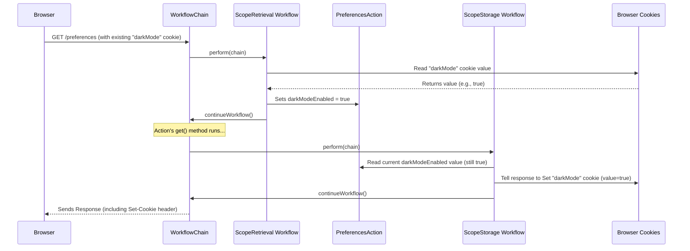

# Chapter 6: Scopes (Scope / ScopeWorkflows)

Welcome to Chapter 6! In [Chapter 5: Parameter Handling (ParameterWorkflow / ExpressionEvaluator)](05_parameter_handling__parameterworkflow___expressionevaluator__.md), we saw how Prime MVC neatly takes data from an incoming request and places it into the fields of your `Action` object. That's great for data related to a *single* interaction.

But what happens when you need to remember information *across* multiple requests? For example, how does an online store remember what's in your shopping cart as you browse different product pages, even before you log in? Or how can a website remember your preference for "dark mode" once you set it? Data stored directly in your Action object usually only lasts for the current request. We need a way to manage data with different lifecycles.

## The Problem: Remembering Things Between Requests

Imagine you're building a feature where users can choose a theme for your website (e.g., "light" or "dark"). A user clicks a button to switch to "dark mode".

1.  The browser sends a request to an `Action` like `/preferences/set-theme?theme=dark`.
2.  The `Action` saves this preference somewhere.
3.  The user then navigates to a different page, say `/dashboard`.

When the request for `/dashboard` comes in, how does the `Action` handling the dashboard know that this user previously chose "dark mode"? The original `Action` instance that handled `/preferences/set-theme` is long gone. We need a place to store this "dark mode" setting that persists longer than a single request.

## The Solution: Scopes - Different Kinds of Memory

Prime MVC provides the concept of **Scopes** to solve this. Think of scopes as different types of memory storage available to your web application, each with a different lifespan:

1.  **`RequestScope`**: This is like **very short-term memory**. It holds data *only* for the duration of the current, single HTTP request. Once the response is sent, this data is gone. It's useful for temporary information needed during request processing. (Under the hood, this often uses request attributes).
2.  **`BrowserSessionScope` / `ManagedCookieScope`**: These are like **longer-term memory**, but specific to the user's *browser*. They store data in **cookies**, which are small pieces of text sent back and forth between the browser and the server. This data can last across multiple requests, potentially until the user closes their browser (`BrowserSessionScope`) or even longer if configured (`ManagedCookieScope`). This is perfect for things like shopping carts, user preferences (like our dark mode example), or remembering if someone is logged in.
3.  **`ContextScope`**: This is like **application-wide memory**. Data stored here is available across *all* requests from *all* users. It's useful for application-level settings or shared resources loaded at startup. (Under the hood, this often uses the ServletContext attributes).

There are other specialized scopes too, like `BrowserActionSessionScope` which ties data to a specific Action class but stores it in a cookie.

## How to Use Scopes: Annotations and Workflows

Using scopes in Prime MVC is designed to be easy. You typically just need to:

1.  **Declare a field** in your `Action` class to hold the data you want to manage.
2.  **Annotate that field** with the appropriate scope annotation (e.g., `@Request`, `@BrowserSession`).

Prime MVC takes care of the rest using two special `Workflow` steps (remember the assembly line from [Chapter 4: Workflow & WorkflowChain](04_workflow___workflowchain__.md)?):

*   **`ScopeRetrievalWorkflow`**: This workflow runs *early* in the request processing cycle, *before* your action method executes. Its job is to look at the scope annotations on your action fields and **load** the data *from* the corresponding scope (request attributes, cookies, etc.) *into* your action fields.
*   **`ScopeStorageWorkflow`**: This workflow runs *later* in the cycle, *after* your action method has executed (and often after the result has been processed). Its job is to look at the same scope annotations and **save** the current values *from* your action fields *back into* the corresponding scope.

Think of these workflows as assistants automatically managing your sticky notes (scopes) – reading them before you start work and updating them when you're done.

**Example: Remembering Dark Mode**

Let's make our dark mode preference work using `@BrowserSession`.

```java
// src/main/java/com/example/action/PreferencesAction.java
package com.example.action;

import org.primeframework.mvc.action.annotation.Action;
import org.primeframework.mvc.action.result.annotation.Redirect;
import org.primeframework.mvc.scope.annotation.BrowserSession; // Import the scope annotation

@Action("/preferences")
@Redirect(code = "saved", uri = "/preferences") // Redirect after saving
public class PreferencesAction {

  // This field will be automatically loaded from and saved to
  // a browser cookie named "darkMode".
  @BrowserSession(name = "darkMode")
  public Boolean darkModeEnabled;

  // Handles GET requests to /preferences
  public String get() {
    // Thanks to ScopeRetrievalWorkflow, darkModeEnabled is already populated
    // with the value from the "darkMode" cookie (if it exists).
    // If the cookie didn't exist, it will likely be null.
    System.out.println("Displaying preferences page. Dark mode: " + darkModeEnabled);
    // We would use darkModeEnabled in our template (e.g., show-prefs.ftl)
    // to render the page correctly.
    return "show-prefs"; // Defined elsewhere (e.g., @Forward)
  }

  // Handles POST requests to /preferences (e.g., from a form submission)
  public String post() {
    // Assume Parameter Handling populated darkModeEnabled from the form
    // based on the user's selection (e.g., a checkbox named "darkModeEnabled").
    System.out.println("Received preference update. Dark mode set to: " + darkModeEnabled);

    // We don't need to explicitly save the value here!
    // After this method returns "saved", the ScopeStorageWorkflow will
    // automatically take the value in the darkModeEnabled field
    // and save it back into the "darkMode" cookie.

    return "saved"; // Triggers the redirect defined above
  }
}
```

**What happens:**

1.  **First Visit (GET /preferences):**
    *   `ScopeRetrievalWorkflow` runs. It looks for a cookie named `"darkMode"`. If not found, `darkModeEnabled` remains `null` (or its default).
    *   `get()` method runs. It sees `darkModeEnabled` is `null`.
    *   The "show-prefs" template is rendered, maybe showing the "light mode" as default.
2.  **User enables Dark Mode and Submits (POST /preferences):**
    *   The browser sends the form data, maybe `darkModeEnabled=true`.
    *   `ScopeRetrievalWorkflow` runs (loads `null` if cookie still not set).
    *   [Parameter Handling (ParameterWorkflow / ExpressionEvaluator)](05_parameter_handling__parameterworkflow___expressionevaluator__.md) runs and sets `darkModeEnabled` to `true` based on the form data.
    *   `post()` method runs.
    *   `post()` returns `"saved"`.
    *   `ScopeStorageWorkflow` runs *after* the action. It sees the `@BrowserSession(name = "darkMode")` annotation on `darkModeEnabled`. It gets the current value (`true`) and saves it into a cookie named `"darkMode"`.
    *   The framework performs the redirect to `/preferences`.
3.  **After Redirect (GET /preferences):**
    *   `ScopeRetrievalWorkflow` runs. It looks for the `"darkMode"` cookie. It finds it and reads the value (`true`). It sets the `darkModeEnabled` field in the new `PreferencesAction` instance to `true`.
    *   `get()` method runs. It sees `darkModeEnabled` is now `true`.
    *   The "show-prefs" template is rendered, showing the page in dark mode.

It just works! You annotate the field, and the workflows handle the loading and saving automatically based on the scope you chose.

## Under the Hood: Scope Workflows in Action

Let's visualize how the workflows manage a scoped field like `darkModeEnabled`.

1.  **Request Starts:** A request comes in (e.g., `GET /preferences`).
2.  **Workflow Chain:** The request enters the `WorkflowChain`.
3.  **Scope Retrieval:** The chain reaches the `ScopeRetrievalWorkflow` station.
    *   This workflow looks at the current `Action` (e.g., `PreferencesAction`).
    *   It finds the `darkModeEnabled` field annotated with `@BrowserSession(name = "darkMode")`.
    *   It asks the appropriate `Scope` implementation (`BrowserSessionScope`) to `get` the value associated with the name `"darkMode"` from the cookies in the `HTTPRequest`.
    *   The `BrowserSessionScope` reads the cookie, potentially decodes/decrypts it, and returns the value (e.g., `true`).
    *   The `ScopeRetrievalWorkflow` sets the `darkModeEnabled` field on the action instance to `true`.
    *   It calls `chain.continueWorkflow()`.
4.  **Other Workflows:** Other stations run, like [Parameter Handling (ParameterWorkflow / ExpressionEvaluator)](05_parameter_handling__parameterworkflow___expressionevaluator__.md) and [Action Invocation (ActionInvocationWorkflow)](01_action___actioninvocation_.md). Your action method (`get()` or `post()`) executes. The value of `darkModeEnabled` might change during this phase (especially in a `post` method).
5.  **Scope Storage:** The chain eventually reaches the `ScopeStorageWorkflow` station (usually after the action and possibly result handling).
    *   This workflow looks at the `Action` again.
    *   It finds the `darkModeEnabled` field with `@BrowserSession(name = "darkMode")`.
    *   It gets the *current* value of the `darkModeEnabled` field from the action instance (e.g., maybe it was updated to `false` in the `post` method).
    *   It asks the `BrowserSessionScope` to `set` the value (`false`) for the name `"darkMode"`.
    *   The `BrowserSessionScope` takes the value (`false`), encodes/encrypts it as needed, and sets a cookie named `"darkMode"` in the `HTTPResponse`.
    *   It calls `chain.continueWorkflow()`.
6.  **Response Sent:** The response (including the `Set-Cookie` header) is sent back to the browser.

**Simplified Diagram:**



**Key Code Components:**

*   **`Scope<T extends Annotation>` Interface (`main/java/org/primeframework/mvc/scope/Scope.java`):** Defines the contract for any scope type.

    ```java
    package org.primeframework.mvc.scope;
    import java.lang.annotation.Annotation;

    public interface Scope<T extends Annotation> {
      // Retrieve a value from the scope
      Object get(String fieldName, Class<?> type, T scope);

      // Store a value into the scope
      void set(String fieldName, Object value, T scope);
    }
    ```
    Implementations like `RequestScope`, `BrowserSessionScope`, `ManagedCookieScope` provide the logic for specific storage mechanisms (request attributes, cookies, etc.).

*   **Scope Annotations (e.g., `@BrowserSession`)**: These are regular Java annotations placed on action fields. They are also marked with `@ScopeAnnotation`.

    ```java
    // Example annotation structure (simplified)
    package org.primeframework.mvc.scope.annotation;
    // ... imports ...
    import org.primeframework.mvc.scope.BrowserSessionScope;

    @ScopeAnnotation(BrowserSessionScope.class) // Links to the Scope implementation
    @Retention(RetentionPolicy.RUNTIME)
    @Target(ElementType.FIELD)
    public @interface BrowserSession {
        String name() default "##field-name##"; // Cookie name
        boolean encrypt() default true;       // Option for encryption
        // ... other options like compress, sameSite ...
    }
    ```
    The `@ScopeAnnotation(BrowserSessionScope.class)` is key – it tells Prime MVC which `Scope` implementation handles fields marked with `@BrowserSession`.

*   **`ScopeProvider` (`main/java/org/primeframework/mvc/scope/ScopeProvider.java`):** An interface to look up the `Scope` implementation based on an annotation type.

    ```java
    package org.primeframework.mvc.scope;
    import java.lang.annotation.Annotation;

    public interface ScopeProvider {
      // Looks up the scope for the given annotation type
      Scope lookup(Class<? extends Annotation> scopeAnnotation);
    }
    ```
    The `DefaultScopeProvider` uses the `@ScopeAnnotation` meta-annotation to find the correct `Scope` class and gets an instance using dependency injection.

*   **`ScopeRetrievalWorkflow` (`main/java/org/primeframework/mvc/scope/DefaultScopeRetrievalWorkflow.java`):** The workflow responsible for loading values *into* the action.

    ```java
    package org.primeframework.mvc.scope;
    // ... imports ...

    public class DefaultScopeRetrievalWorkflow implements ScopeRetrievalWorkflow {
      private final ActionInvocationStore actionInvocationStore;
      private final ScopeRetriever scopeRetriever; // Helper class

      @Inject
      public DefaultScopeRetrievalWorkflow(ActionInvocationStore ais, ScopeRetriever sr) {
        this.actionInvocationStore = ais;
        this.scopeRetriever = sr;
      }

      public void perform(WorkflowChain chain) throws IOException {
        // Uses the ScopeRetriever to load values into the action
        scopeRetriever.setScopedValues(actionInvocationStore.getCurrent());
        chain.continueWorkflow();
      }
      // ... loadScopedMembers helper method in original code ...
    }
    ```
    It delegates the complex logic of finding fields and calling `Scope.get` to the `ScopeRetriever`.

*   **`ScopeStorageWorkflow` (`main/java/org/primeframework/mvc/scope/DefaultScopeStorageWorkflow.java`):** The workflow responsible for saving values *from* the action.

    ```java
    package org.primeframework.mvc.scope;
    // ... imports ...

    public class DefaultScopeStorageWorkflow implements ScopeStorageWorkflow {
      private final ActionInvocationStore actionInvocationStore;
      private final ScopeProvider scopeProvider; // To find the right Scope

      @Inject
      public DefaultScopeStorageWorkflow(ActionInvocationStore ais, ScopeProvider sp) {
        this.actionInvocationStore = ais;
        this.scopeProvider = sp;
      }

      public void perform(WorkflowChain chain) throws IOException {
        ActionInvocation ai = actionInvocationStore.getCurrent();
        Object action = ai.action;
        ActionConfiguration config = ai.configuration;

        // Find all fields marked with scope annotations in the action config
        List<ScopeField> scopeFields = (config != null) ? config.scopeFields : null;
        if (action != null && scopeFields != null && scopeFields.size() > 0) {
          // For each scoped field...
          for (ScopeField scopeField : scopeFields) {
            // 1. Find the correct Scope handler (e.g., BrowserSessionScope)
            Scope scope = scopeProvider.lookup(scopeField.annotationType);
            // 2. Get the current value from the action field
            Object value = ReflectionUtils.getField(scopeField.field, action);
            // 3. Tell the Scope handler to save it
            scope.set(scopeField.field.getName(), value, scopeField.annotation);
          }
        }
        chain.continueWorkflow();
      }
      // ... storeScopedMembers helper method in original code ...
    }
    ```
    This workflow iterates through the configured scope fields, gets their current values from the action, finds the appropriate `Scope` handler using the `ScopeProvider`, and calls `scope.set` to save the value.

## Conclusion

You've learned how Prime MVC helps manage data that needs to live longer than a single request using **Scopes**:

*   Scopes provide different "memory" types like `RequestScope` (single request) and `BrowserSessionScope` or `ManagedCookieScope` (using cookies to persist across requests).
*   You typically use annotations like `@Request` or `@BrowserSession` on fields within your `Action` classes.
*   The **`ScopeRetrievalWorkflow`** automatically loads data *from* the scope into your annotated fields *before* your action runs.
*   The **`ScopeStorageWorkflow`** automatically saves data *from* your annotated fields *back into* the scope *after* your action runs.

This system makes it easy to handle stateful interactions, like user preferences or shopping carts, without manually managing cookies or request attributes in your action logic.

Now that we can manage data across requests, how do we handle displaying messages to the user, like "Settings saved successfully!" or "Invalid username or password"? That's where Message Handling comes in.

**Next:** [Chapter 7: Message Handling (MessageStore / MessageProvider)](07_message_handling__messagestore___messageprovider__.md)

---

Generated by [AI Codebase Knowledge Builder](https://github.com/The-Pocket/Tutorial-Codebase-Knowledge)