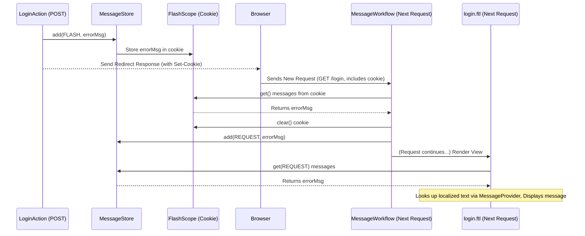

# Chapter 7: Message Handling (MessageStore / MessageProvider)

Welcome back! In [Chapter 6: Scopes (Scope / ScopeWorkflows)](06_scopes__scope___scopeworkflows__.md), we saw how Prime MVC manages data across multiple requests using scopes like `@BrowserSession`. Now, let's think about how we communicate back to the user.

When a user performs an action, like saving their profile or trying to log in, we often need to give them feedback. This could be a success message ("Profile updated successfully!") or an error message ("Invalid username or password."). How do we manage these messages effectively, especially if we need them to appear *after* a redirect, or if we want to support multiple languages?

## The Problem: Showing Feedback to Users

Imagine a user tries to log in to your website.
*   If they succeed, you might redirect them to their dashboard and show a "Welcome back!" message.
*   If they fail (wrong password), you want to show the login form again with a clear error message like "Invalid login attempt."

How do we:
1.  Temporarily store these messages during request processing?
2.  Make sure messages appear even after a redirect (like the successful login)?
3.  Display messages in the user's preferred language?

## The Solution: MessageStore and MessageProvider

Prime MVC provides a system for handling user-facing messages using two main components:

1.  **`MessageStore`**: Think of this as a **temporary message board** or a set of **sticky notes** for the current request or the *next* request. When your `Action` logic runs, you can add messages (like "Login failed" or "Settings saved") to the `MessageStore`. These messages are often tagged with a type (like `INFO`, `ERROR`, `SUCCESS`) and a scope (like `REQUEST` or `FLASH`).
    *   **`REQUEST` Scope:** Messages stored here only exist for the *current* request. They are displayed on the page rendered by the current action.
    *   **`FLASH` Scope:** Messages stored here are designed to survive a redirect. They are stored temporarily (often using the session or cookies, similar to [Chapter 6: Scopes (Scope / ScopeWorkflows)](06_scopes__scope___scopeworkflows__.md)) and then moved to the `REQUEST` scope on the *very next* request. This is perfect for showing "Save successful" messages after redirecting the user.

2.  **`MessageProvider`**: This acts like a **translator** or a **dictionary**. Instead of writing the exact message text ("Invalid login attempt") directly in your code, you often use a unique code or *key* (e.g., `"[InvalidLogin]"`). The `MessageProvider` looks up this key in language-specific files (resource bundles) based on the user's locale (language preference) and returns the correctly translated text. This is essential for building multilingual applications (Internationalization or i18n).

3.  **Display Controls (e.g., `<control:message>` / `<control:messages>`)**: These are special tags you use in your view templates (like FreeMarker `.ftl` files). They automatically interact with the `MessageStore` to display the stored messages or use the `MessageProvider` to look up and display localized messages based on keys.

## How to Use: Adding and Displaying Messages

Let's enhance a hypothetical login action.

**Step 1: Add Messages in your Action**

You can inject the `MessageStore` into your `Action` and add messages based on the outcome.

```java
package com.example.action;

import com.google.inject.Inject;
import org.primeframework.mvc.action.annotation.Action;
import org.primeframework.mvc.action.result.annotation.Redirect;
import org.primeframework.mvc.message.MessageStore;
import org.primeframework.mvc.message.MessageType;
import org.primeframework.mvc.message.SimpleFieldMessage; // For field errors
import org.primeframework.mvc.message.SimpleMessage; // For general messages
import org.primeframework.mvc.message.l10n.MessageProvider; // For localized keys
import org.primeframework.mvc.message.scope.MessageScope; // For FLASH scope

@Action("/login")
@Redirect(code = "success", uri = "/dashboard") // Redirect on success
@Redirect(code = "error", uri = "/login")     // Redirect back to login on error
public class LoginAction {

  @Inject public MessageStore messageStore;
  @Inject public MessageProvider messageProvider; // Usually needed for *getting* messages

  // Assume these fields are populated by Parameter Handling
  public String username;
  public String password;

  public String post() {
    if (isValidLogin(username, password)) {
      // Add a success message to FLASH scope (will show after redirect)
      // Using a simple string here for demonstration
      messageStore.add(MessageScope.FLASH,
                       new SimpleMessage(MessageType.SUCCESS, "login.success", "Welcome back!"));
      return "success"; // Redirects to /dashboard
    } else {
      // Add a general error message to FLASH scope
      // Using a key for MessageProvider lookup
      messageStore.add(MessageScope.FLASH,
                       new SimpleMessage(MessageType.ERROR, "[InvalidLogin]", "Default Text"));

      // Add a field-specific error message to FLASH scope
      messageStore.add(MessageScope.FLASH,
                       new SimpleFieldMessage(MessageType.ERROR, "password", "[PasswordIncorrect]", "Default Text"));

      return "error"; // Redirects back to /login
    }
  }

  private boolean isValidLogin(String u, String p) {
    // ... check credentials ...
    return "admin".equals(u) && "password123".equals(p);
  }
}
```

*   We inject `MessageStore` to add messages.
*   `SimpleMessage` is for general feedback.
*   `SimpleFieldMessage` links an error to a specific form field (`password`).
*   We use `MessageScope.FLASH` so the messages appear *after* the redirect.
*   We use both literal text ("Welcome back!") and keys (`"[InvalidLogin]"`, `"[PasswordIncorrect]"`) for messages. Keys allow the `MessageProvider` to look up localized text later.

**Step 2: Configure Localized Messages (Optional but Recommended)**

Create property files for different languages. Prime MVC often looks for files based on the action URI and locale. For `/login` and English (`en`):

```properties
# /WEB-INF/messages/login_en.properties (or similar path)
[InvalidLogin]=Invalid username or password combination. Please try again.
[PasswordIncorrect]=The password you entered was incorrect.
```

And for Spanish (`es`):

```properties
# /WEB-INF/messages/login_es.properties
[InvalidLogin]=Combinación de nombre de usuario o contraseña inválida. Inténtalo de nuevo.
[PasswordIncorrect]=La contraseña que ingresaste es incorrecta.
```

The `ResourceBundleMessageProvider` will automatically pick the right file based on the user's browser language settings (via the `LocaleProvider`).

**Step 3: Display Messages in the View**

In your template file (e.g., `/WEB-INF/templates/login.ftl`), use controls to display messages stored in the `MessageStore`.

```html
<!-- /WEB-INF/templates/login.ftl -->
<!DOCTYPE html>
<html>
<head><title>Login</title></head>
<body>
  <h1>Login</h1>

  <#-- Use the 'messages' control to display all messages from the store -->
  <@control.messages />

  <form action="/login" method="post">
    Username: <input type="text" name="username" /> <br/>
    Password: <input type="password" name="password" />
              <#-- Display errors specific to the 'password' field -->
              <@control.fieldErrors name="password" />
              <br/>
    <button type="submit">Log In</button>
  </form>

  <#-- Example of using messageProvider directly via 'message' control -->
  <p><@control.message key="[ForgotPasswordHelp]" default="Need help? Contact support." /></p>
</body>
</html>
```

*   `<@control.messages />`: This tag iterates through all the messages currently in the `MessageStore` (for the `REQUEST` scope, including those moved from `FLASH`) and renders them, often using the `MessageProvider` to look up text if a key was used.
*   `<@control.fieldErrors name="password" />`: This specifically displays `FieldMessage`s associated with the `password` field.
*   `<@control.message key="[...]" />`: This tag uses the `MessageProvider` directly to look up and display a specific localized message by its key.

**What Happens (Login Failure):**

1.  User submits incorrect login details to `/login`.
2.  `LoginAction.post()` runs. `isValidLogin` returns `false`.
3.  Error messages (`[InvalidLogin]`, `[PasswordIncorrect]`) are added to `MessageStore` in `FLASH` scope.
4.  Action returns `"error"`, triggering a redirect to `/login`.
5.  The `FLASH` messages are stored temporarily (e.g., in a cookie).
6.  Browser follows redirect to `GET /login`.
7.  The `DefaultMessageWorkflow` runs early in this *new* request. It finds the messages in the temporary storage (cookie) and moves them into the `REQUEST` scope of the `MessageStore`.
8.  The `LoginAction.get()` method (not shown, but would handle the GET request) runs.
9.  The `login.ftl` template is rendered.
10. `<@control.messages />` finds the general `[InvalidLogin]` message in the `MessageStore`, uses `MessageProvider` to get the localized text ("Invalid username or password..."), and displays it.
11. `<@control.fieldErrors name="password" />` finds the `[PasswordIncorrect]` message for the `password` field, gets the localized text, and displays it near the password input.

## Under the Hood: How Messages Flow

Let's trace the journey of a flash message.

1.  **Action Adds Message:** `messageStore.add(MessageScope.FLASH, message)` is called in your action.
2.  **Store in FlashScope:** `DefaultMessageStore` delegates to the `FlashScope` implementation. `FlashScope` usually stores the message in a way that survives the request (like setting an HTTP cookie containing the message details).
3.  **Redirect:** The action completes, and the browser is redirected.
4.  **Next Request Starts:** The browser makes the *new* request (after the redirect).
5.  **MessageWorkflow Runs:** Early in the workflow chain ([Chapter 4: Workflow & WorkflowChain](04_workflow___workflowchain__.md)), the `DefaultMessageWorkflow` executes.
6.  **Retrieve from Flash:** It calls `flashScope.get()` which reads the message(s) from the temporary storage (e.g., the cookie set in step 2).
7.  **Clear Flash:** It calls `flashScope.clear()` to remove the message from the temporary storage (so it doesn't appear again).
8.  **Add to Request:** It calls `messageStore.addAll(MessageScope.REQUEST, messages)` to put the retrieved messages into the `REQUEST` scope for the *current* request.
9.  **View Renders:** Later, when the view template is rendered, controls like `<control:messages>` read from `messageStore.get(MessageScope.REQUEST)` and display the messages. If a message has a key (like `"[InvalidLogin]"`), the control uses the `MessageProvider`.
10. **MessageProvider Lookup:** The `MessageProvider` (e.g., `ResourceBundleMessageProvider`) gets the user's locale (e.g., `es_MX`), searches for appropriate resource bundle files (like `login_es_MX.properties`, `login_es.properties`, `login.properties`), finds the key `"[InvalidLogin]"`, and returns the corresponding translated string.

**Simplified Flash Message Flow Diagram:**



**Key Code Components:**

*   **`MessageStore` Interface (`main/java/org/primeframework/mvc/message/MessageStore.java`):** Defines how to add and retrieve messages from different scopes.

    ```java
    public interface MessageStore {
      // Add message to default (REQUEST) scope
      void add(Message message);

      // Add message to a specific scope
      void add(MessageScope scope, Message message);

      // Add multiple messages
      void addAll(MessageScope scope, Collection<Message> messages);

      // Get all messages (usually from REQUEST scope implicitly)
      List<Message> get();

      // Get messages from a specific scope
      List<Message> get(MessageScope scope);

      // Get only field-specific messages
      Map<String, List<FieldMessage>> getFieldMessages(MessageScope scope);

      // Clear messages
      void clear(MessageScope scope);
    }
    ```

*   **`DefaultMessageStore` (`main/java/org/primeframework/mvc/message/DefaultMessageStore.java`):** Standard implementation that uses underlying `Scope` objects (`RequestScope`, `FlashScope`, `ApplicationScope`).

    ```java
    public class DefaultMessageStore implements MessageStore {
      private final Map<MessageScope, Scope> scopes = new LinkedHashMap<>();
      // ... constructor injecting RequestScope, FlashScope, etc. ...

      @Override
      public void add(MessageScope scope, Message message) {
        Scope s = scopes.get(scope); // Get the right scope handler (e.g., FlashScope)
        s.add(message); // Delegate adding to that scope handler
      }
      // ... other methods delegate similarly ...
    }
    ```

*   **`MessageScope` Interface (`main/java/org/primeframework/mvc/message/scope/MessageScope.java`):** Marker interface defining standard scopes like `REQUEST`, `FLASH`, `APPLICATION`.

*   **`FlashScope` Interface (`main/java/org/primeframework/mvc/message/scope/FlashScope.java`):** (and its implementation) Handles the specific logic of storing/retrieving flash messages, often using cookies or session attributes.

*   **`MessageWorkflow` Interface (`main/java/org/primeframework/mvc/message/MessageWorkflow.java`):** Identifies the workflow step responsible for message handling (like moving flash messages).

*   **`DefaultMessageWorkflow` (`main/java/org/primeframework/mvc/message/DefaultMessageWorkflow.java`):** Implements the logic to move messages from `FlashScope` to `RequestScope`.

    ```java
    public class DefaultMessageWorkflow implements MessageWorkflow {
      private final FlashScope flashScope;
      private final MessageStore messageStore;
      // ... constructor ...

      public void perform(WorkflowChain chain) throws IOException {
        // 1. Get messages from Flash storage (e.g., cookie)
        List<Message> messages = flashScope.get();
        // 2. Clear them from Flash storage
        flashScope.clear();
        // 3. Add them to the Request scope for the current request
        messageStore.addAll(MessageScope.REQUEST, messages);
        // 4. Continue the workflow
        chain.continueWorkflow();
      }
    }
    ```

*   **`MessageProvider` Interface (`main/java/org/primeframework/mvc/message/l10n/MessageProvider.java`):** Defines how to look up localized messages.

    ```java
    public interface MessageProvider {
      // Get message by key, throw exception if missing
      String getMessage(String key, Object... values) throws MissingMessageException;

      // Get message by key, return null if missing
      String getOptionalMessage(String key, Object... values);
    }
    ```

*   **`ResourceBundleMessageProvider` (`main/java/org/primeframework/mvc/message/l10n/ResourceBundleMessageProvider.java`):** Standard implementation using Java `ResourceBundle`s to find messages in `.properties` files based on action URI and locale. It has a sophisticated search path (e.g., `foo/bar_en_US.properties`, `foo/bar_en.properties`, `foo/package_en.properties`, `package.properties`).

*   **`<control:messages>` / `<control:message>` (`main/java/org/primeframework/mvc/control/message/Message.java`):** UI Controls used in templates to display messages, interacting with `MessageStore` and `MessageProvider`.

## Conclusion

You've now learned how Prime MVC handles user-facing messages gracefully:

*   The **`MessageStore`** acts as a temporary container for messages, using scopes like `REQUEST` (current request) and `FLASH` (next request after redirect).
*   The **`MessageProvider`** looks up localized message text based on a key (like `"[InvalidLogin]"`) and the user's locale, enabling internationalization.
*   The **`MessageWorkflow`** ensures flash messages are correctly transferred between requests.
*   **View Controls** (like `<control:messages>`) provide an easy way to display these messages to the user in your templates.

This system keeps your action logic clean while providing powerful feedback and localization capabilities.

With data handling, scopes, and user messages covered, we need to consider how to protect our application. How do we ensure only logged-in users can access certain pages or perform specific actions? That's the topic of our next chapter on Security.

**Next:** [Chapter 8: Security (SecurityScheme / SecurityWorkflow)](08_security__securityscheme___securityworkflow__.md)

---

Generated by [AI Codebase Knowledge Builder](https://github.com/The-Pocket/Tutorial-Codebase-Knowledge)