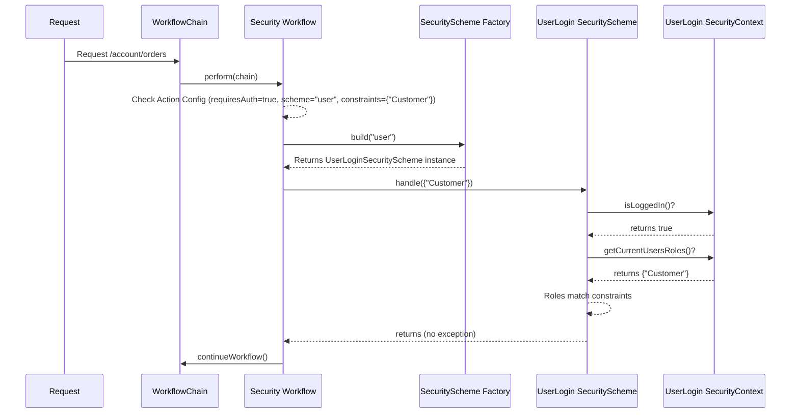

# Chapter 8: Security (SecurityScheme / SecurityWorkflow)

Welcome to Chapter 8! In [Chapter 7: Message Handling (MessageStore / MessageProvider)](07_message_handling__messagestore___messageprovider__.md), we explored how to show feedback messages to users, like success confirmations or error alerts. Now, let's tackle a crucial aspect of any web application: security.

How do we make sure that only logged-in users can see their profile page? Or that only users with an "Admin" role can access the site administration tools? We need a way to guard our actions and control who gets access.

## The Problem: Guarding Your Actions

Imagine you have an online store. Any visitor should be able to browse products, but only registered, logged-in users should be able to view their order history or change their account settings. If someone tries to directly access the URL for `/account/orders` without being logged in, they should be stopped, perhaps redirected to the login page.

We need a security checkpoint in our request processing pipeline.

## The Solution: SecurityWorkflow and SecuritySchemes - The Bouncers

Prime MVC handles security using a combination of a workflow and specific security strategies:

1.  **`SecurityWorkflow`**: Think of this as the **security checkpoint** or the **bouncer** standing at the entrance to your protected actions. It's a specific station on the request processing assembly line ([Chapter 4: Workflow & WorkflowChain](04_workflow___workflowchain__.md)). Its job is to check if the current request needs a security check and, if so, to enforce it using one or more security strategies.

2.  **`SecurityScheme`**: This represents a specific **method or strategy** for verifying security. It's like the different ways a bouncer might check ID:
    *   **`UserLoginSecurityScheme`**: Checks if the user is logged in (based on their session or cookies) and optionally checks if they have the required roles (like "Admin" or "Editor"). This relies on an application-provided component (`UserLoginSecurityContext`) to know who is logged in.
    *   **`JWTSecurityScheme`**: Checks for a valid JSON Web Token (JWT) in the request header, often used for securing APIs. It verifies the token's signature and expiration and can check claims within the token. This relies on a `JWTSecurityContext`.
    *   **`AuthorizeMethodScheme`**: Doesn't perform checks itself but calls specific methods you write directly in your Action class, allowing for very custom authorization logic.
    *   *(Others can exist too).*

3.  **Authentication vs. Authorization**:
    *   **Authentication (AuthN):** "Who are you?" Are you actually logged in? Is your identity verified?
    *   **Authorization (AuthZ):** "What are you allowed to do?" Now that we know who you are, do you have permission (e.g., the right role) to access this specific resource or perform this action?
    `SecurityScheme` implementations typically handle both.

4.  **Configuration**: You tell the `SecurityWorkflow` *which* `SecurityScheme`(s) to use and *what constraints* (like required roles) apply to each action. This is often done using attributes within the `@Action` annotation.

## How to Use: Protecting an Action

Let's protect an action that shows the user's order history.

**Step 1: Annotate Your Action**

Modify the `@Action` annotation on your action class to indicate that authentication is required and specify any role constraints.

```java
package com.example.action.account;

import org.primeframework.mvc.action.annotation.Action;
import org.primeframework.mvc.action.result.annotation.Forward;

// Action mapped to "/account/orders"
@Action(
    value = "/account/orders",
    requiresAuthentication = true, // <-- Tells SecurityWorkflow to check!
    constraints = {"Customer"}     // <-- Optional: Only allow users with "Customer" role
    // schemes = {"user"}          // <-- Optional: Explicitly specify the 'user' scheme (often the default)
)
@Forward(code = "success", page = "/WEB-INF/views/account/orders.ftl")
public class ViewOrdersAction {

    // Field to hold order data (populated somehow)
    public List<Order> orders;

    public String get() {
        // If the SecurityWorkflow lets the request through,
        // this method will only execute for authenticated users
        // who also have the "Customer" role (if specified).

        System.out.println("Fetching orders for logged-in customer...");
        // ... load orders for the current user ...
        // (How to get the current user? Often via an injected UserLoginSecurityContext)
        return "success";
    }
}
```

*   `requiresAuthentication = true`: This is the key flag. It tells the `DefaultSecurityWorkflow` that this action needs protection.
*   `constraints = {"Customer"}`: This is an array of strings passed to the `SecurityScheme`. For `UserLoginSecurityScheme`, these are typically interpreted as required roles. The user must have *at least one* of these roles (or often *all*, depending on the `UserLoginConstraintsValidator` implementation) to proceed.
*   `schemes = {"user"}`: (Optional) Explicitly lists the names of the `SecurityScheme` implementations to use. If omitted, Prime MVC often defaults to configured schemes (commonly "user"). The schemes are tried in order.

**Step 2: Provide the Security Context (Application Level)**

The `SecurityScheme` needs to know *how* to check if a user is logged in or what roles they have. This is application-specific. You need to provide an implementation of the relevant context interface, usually via Guice dependency injection.

*   For `UserLoginSecurityScheme`, you implement `UserLoginSecurityContext`.

```java
// Example - Simplified implementation (usually more complex)
// This class needs to be bound in your Guice module.
public class MyUserLoginSecurityContext implements UserLoginSecurityContext {

    @Inject private HTTPRequest request; // Access to request/session data

    @Override
    public boolean isLoggedIn() {
        // Logic to check if a user ID exists in the session/cookie
        return request.getSession(false) != null &&
               request.getSession().getAttribute("userId") != null;
    }

    @Override
    public Set<String> getCurrentUsersRoles() {
        // Logic to load roles for the user stored in the session
        Object userId = request.getSession().getAttribute("userId");
        if (userId != null) {
            // Look up roles in database based on userId...
            // Example: return Set.of("Customer", "Editor");
            return loadRolesFromDatabase(userId);
        }
        return Collections.emptySet();
    }

    @Override
    public Object getCurrentUser() { /* ... load user object ... */ }
    @Override
    public void login(Object context) { /* ... store user in session ... */ }
    @Override
    public void logout() { /* ... invalidate session ... */ }
    @Override
    public void updateUser(Object user) { /* ... update user in session ... */ }
    @Override
    public String getSessionId() { /* ... return session ID ... */ }

    private Set<String> loadRolesFromDatabase(Object userId) {
        // Placeholder for actual database lookup
        if ("adminUserId".equals(userId)) return Set.of("Customer", "Admin");
        return Set.of("Customer");
    }
}
```

**What Happens Now?**

1.  A user (not logged in) requests `/account/orders`.
2.  The request hits the `DefaultSecurityWorkflow`.
3.  The workflow sees `@Action(requiresAuthentication = true, ...)` on `ViewOrdersAction`.
4.  It determines the scheme to use is "user" (either explicitly or by default).
5.  It gets an instance of `UserLoginSecurityScheme` from the `SecuritySchemeFactory`.
6.  It calls `userLoginScheme.handle(constraints)` (where `constraints` is `{"Customer"}`).
7.  `UserLoginSecurityScheme` calls `myUserLoginSecurityContext.isLoggedIn()`.
8.  This returns `false`.
9.  `UserLoginSecurityScheme` throws an `UnauthenticatedException`.
10. `DefaultSecurityWorkflow` catches this. Since there are no more schemes to try, it re-throws the `UnauthenticatedException`.
11. The framework's exception handling ([Chapter 9: Exception Handling (ErrorException / ExceptionHandler)](09_exception_handling__errorexception___exceptionhandler__.md)) usually catches this and redirects the user to a configured login page.

If the user *was* logged in but only had the "Viewer" role:
*   `isLoggedIn()` would return `true`.
*   The scheme would then check roles against the `{"Customer"}` constraint.
*   `getCurrentUsersRoles()` would return `{"Viewer"}`.
*   The `UserLoginConstraintsValidator` would determine the roles don't match the constraints.
*   `UserLoginSecurityScheme` would throw an `UnauthorizedException`.
*   `DefaultSecurityWorkflow` lets this exception propagate.
*   The framework's exception handling usually shows a "Forbidden" (403) error page.

If the user *was* logged in and *had* the "Customer" role, `handle()` would complete successfully, and the `DefaultSecurityWorkflow` would call `chain.continueWorkflow()`, allowing the request to proceed to the next step (like Parameter Handling or Action Invocation).

## Under the Hood: The Security Checkpoint

Let's trace the flow when a request requires authentication.

1.  **Request Arrives:** A request for a protected URL (e.g., `/account/orders`) enters the system.
2.  **Workflow Chain:** The request proceeds along the `WorkflowChain` ([Chapter 4: Workflow & WorkflowChain](04_workflow___workflowchain__.md)).
3.  **Security Workflow:** The chain reaches the `DefaultSecurityWorkflow`.
4.  **Check Configuration:** The workflow retrieves the `ActionInvocation` and checks its configuration (`actionInvocation.configuration`).
    *   Does the `@Action` have `requiresAuthentication = true`?
    *   Is there an `@AnonymousAccess` annotation on the specific method being called? (If so, skip checks).
5.  **Get Schemes & Constraints:** If checks are needed, it identifies the security schemes configured for the action (e.g., `{"user", "jwt"}`) and the constraints (e.g., `{"Customer"}`). It might also check for constraint overrides.
6.  **Loop Through Schemes:** It iterates through the configured scheme names.
7.  **Get Scheme Instance:** For the first scheme name (e.g., "user"), it asks the `SecuritySchemeFactory` to `build("user")`. The factory returns an instance of `UserLoginSecurityScheme`.
8.  **Execute Scheme:** It calls `securityScheme.handle(constraints)` on the `UserLoginSecurityScheme` instance.
9.  **Scheme Logic:** The `UserLoginSecurityScheme` uses the injected `UserLoginSecurityContext` (your application's implementation) to check `isLoggedIn()` and potentially roles against the constraints (`{"Customer"}`).
10. **Outcome:**
    *   **Success:** `handle` completes without throwing an exception. The `DefaultSecurityWorkflow` calls `chain.continueWorkflow()`, and the request proceeds.
    *   **Authentication Failure (`UnauthenticatedException`):** `handle` throws `UnauthenticatedException` (e.g., user not logged in). The `DefaultSecurityWorkflow` catches this. If there are more schemes configured (e.g., "jwt"), it proceeds to step 7 for the next scheme. If this was the last scheme, it throws `UnauthenticatedException`.
    *   **Authorization Failure (`UnauthorizedException`):** `handle` throws `UnauthorizedException` (e.g., user logged in but lacks required role). The `DefaultSecurityWorkflow` *does not* catch this; it lets the exception propagate up the chain, usually resulting in a 403 Forbidden error.
11. **Final Result:** If any scheme succeeds, the request continues. If all schemes fail with `UnauthenticatedException`, the final result is `UnauthenticatedException`. If any scheme throws `UnauthorizedException`, the result is `UnauthorizedException`.

**Simplified Diagram:**



**Key Code Components:**

*   **`SecurityScheme` Interface (`main/java/org/primeframework/mvc/security/SecurityScheme.java`):** The core contract for any security checking strategy.

    ```java
    public interface SecurityScheme {
      // Performs authentication and authorization check
      // Throws UnauthenticatedException for login failures
      // Throws UnauthorizedException for permission failures
      void handle(String[] constraints);
    }
    ```

*   **`UserLoginSecurityScheme` (`main/java/org/primeframework/mvc/security/UserLoginSecurityScheme.java`):** Implementation using `UserLoginSecurityContext` for session/role-based security. It checks `isLoggedIn()` and uses `UserLoginConstraintsValidator` to check roles against constraints.

*   **`JWTSecurityScheme` (`main/java/org/primeframework/mvc/security/JWTSecurityScheme.java`):** Implementation using `JWTSecurityContext` for JWT-based security. It verifies the JWT and uses `JWTConstraintsValidator`.

*   **`UserLoginSecurityContext` Interface (`main/java/org/primeframework/mvc/security/UserLoginSecurityContext.java`):** **Application-provided** interface defining how to get the current user, roles, login status, etc.

*   **`JWTSecurityContext` Interface (`main/java/org/primeframework/mvc/security/JWTSecurityContext.java`):** **Application-provided** interface defining how to get the JWT from the current request.

*   **`SecurityWorkflow` Interface (`main/java/org/primeframework/mvc/security/SecurityWorkflow.java`):** Marker interface for the security workflow step.

*   **`DefaultSecurityWorkflow` (`main/java/org/primeframework/mvc/security/DefaultSecurityWorkflow.java`):** The standard workflow implementation. It reads action configuration, iterates through configured schemes obtained from the factory, calls `handle`, and manages the `UnauthenticatedException` / `UnauthorizedException` flow.

    ```java
    // Simplified logic of perform method
    public void perform(WorkflowChain workflowChain) throws IOException {
      ActionInvocation actionInvocation = // ... get current invocation ...
      if (/* action requires authentication and is not anonymous */) {
        String[] constraints = getConstraints(actionInvocation); // Get constraints from @Action or overrides
        String[] schemes = actionInvocation.configuration.securitySchemes; // Get scheme names

        for (String schemeName : schemes) {
          SecurityScheme securityScheme = factory.build(schemeName);
          try {
            securityScheme.handle(constraints);
            // Success! Continue the main workflow.
            workflowChain.continueWorkflow();
            return; // Security check passed
          } catch (UnauthenticatedException ignore) {
            // Authentication failed for THIS scheme.
            // Loop continues to try the next scheme (if any).
          } catch (UnauthorizedException e) {
            // Authorization failed. This is fatal for the request.
            throw e; // Let it propagate up.
          }
        }
        // If loop finishes, all schemes failed authentication.
        throw new UnauthenticatedException();
      } else {
        // No security required for this action
        workflowChain.continueWorkflow();
      }
    }
    ```

*   **`SecuritySchemeFactory` (`main/java/org/primeframework/mvc/security/guice/SecuritySchemeFactory.java`):** Used by the `SecurityWorkflow` to get instances of `SecurityScheme` implementations based on their configured names (like "user", "jwt"). The `SecurityModule` registers known schemes with the factory.

*   **`@Action` Annotation:** Attributes like `requiresAuthentication`, `constraints`, and `schemes` configure the security requirements for an action.

## Conclusion

You've now seen how Prime MVC provides a robust way to secure your actions:

*   The **`SecurityWorkflow`** acts as the central checkpoint in the request processing pipeline.
*   **`SecurityScheme`** implementations (like `UserLoginSecurityScheme` or `JWTSecurityScheme`) provide specific strategies for verifying credentials and permissions.
*   You configure security requirements using annotations (primarily `@Action`) on your action classes.
*   The system distinguishes between **Authentication** (Are you logged in?) and **Authorization** (Do you have permission?).
*   Your application provides the context (like `UserLoginSecurityContext`) to link the security schemes to your specific user management system.

This framework allows you to define clear security rules for your application endpoints.

But what happens when things go wrong? An `UnauthenticatedException` or `UnauthorizedException` might be thrown, or maybe a database error occurs within your action. How does Prime MVC handle these errors gracefully? That's the subject of our next chapter.

**Next:** [Chapter 9: Exception Handling (ErrorException / ExceptionHandler)](09_exception_handling__errorexception___exceptionhandler__.md)

---

Generated by [AI Codebase Knowledge Builder](https://github.com/The-Pocket/Tutorial-Codebase-Knowledge)