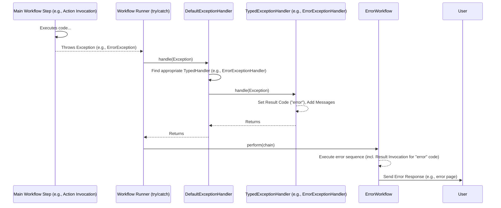

# Chapter 9: Exception Handling (ErrorException / ExceptionHandler)

Welcome to Chapter 9! In [Chapter 8: Security (SecurityScheme / SecurityWorkflow)](08_security__securityscheme___securityworkflow__.md), we saw how Prime MVC protects actions using security schemes and workflows. These security checks can sometimes result in exceptions like `UnauthenticatedException` (user not logged in) or `UnauthorizedException` (user doesn't have permission). But what happens when these or other unexpected problems occur anywhere else during request processing?

Imagine your action tries to load data from a database, but the database server is temporarily down. Or maybe the user submits invalid data that passes initial checks but causes an issue later. If we don't handle these situations, the user might see an ugly, confusing error page (a stack trace), which is unprofessional and unhelpful. We need a way to gracefully manage errors.

## The Problem: Dealing with Unexpected Issues

Think of your web application like a chef cooking an order. Usually, everything goes smoothly. But sometimes:
*   An ingredient is missing (database unavailable).
*   A piece of equipment breaks (unexpected bug in code).
*   The customer's request is invalid in a way not caught initially (bad data combination).

If the chef just stops and throws their hands up, the customer gets nothing or a mess. A good kitchen needs a process for handling these problems – maybe informing the manager, substituting an ingredient if possible, or politely telling the customer there's an issue with their order and suggesting an alternative.

Similarly, our web application needs a robust way to "catch" errors that happen during request processing and decide what to show the user – perhaps a friendly error page, a specific message, or a redirect back to a form with instructions.

## The Solution: An Emergency Response System for Errors

Prime MVC has a built-in system for handling errors that occur during the request processing workflow. It involves several key players:

1.  **`PrimeException`**: This is the base type for most exceptions specifically related to the Prime MVC framework's operation. Think of it as a general alert signal.

2.  **`ErrorException`**: This is a special kind of `PrimeException`. Throwing an `ErrorException` is like activating a specific **red alert** button. It signals that something has gone wrong in a way that should trigger Prime MVC's *dedicated error handling workflow*. Many built-in exceptions, like `UnauthenticatedException`, `UnauthorizedException` (from Chapter 8), and `ValidationException` (often thrown if data validation fails later), are types of `ErrorException`.

3.  **`ExceptionHandler`**: This is the central **emergency dispatcher** or **control center**. When any exception (especially runtime exceptions like `PrimeException` or even unexpected ones like `NullPointerException`) occurs during the main request processing workflow, the `ExceptionHandler` is notified. Its job is to figure out the best way to handle the specific error that occurred.

4.  **`TypedExceptionHandler<T extends Throwable>`**: These are **specialist teams** that the main `ExceptionHandler` can call upon. Each `TypedExceptionHandler` knows how to deal with a *specific type* of exception (`T`). For example:
    *   `ErrorExceptionHandler` is specifically designed to handle `ErrorException` and its subclasses. It knows how to extract information (like a suggested result code) from the `ErrorException`.
    *   You could potentially create your own `TypedExceptionHandler` for other specific exceptions, like a `DatabaseExceptionHandler` for `java.sql.SQLException`.

5.  **`ErrorWorkflow`**: If the `ExceptionHandler` determines that an error needs the special error handling process (often because an `ErrorException` was caught), it triggers the `ErrorWorkflow`. This is a **separate, mini-assembly line** specifically designed to generate an error response for the user. It often reuses standard components like the [Result Invocation Workflow](03_result_handling__result___resultinvocationworkflow__.md) to display an error page based on a result code (e.g., "error", "input", "unauthenticated") set by the exception handler.

## How to Use: Triggering and Handling Errors

Often, you don't need to *do* anything explicitly for common errors. If a security check fails, the `SecurityWorkflow` throws `UnauthenticatedException` or `UnauthorizedException`. If data validation fails, the validation system might throw `ValidationException`. Because these are all types of `ErrorException`, the system handles them automatically:

1.  Exception is thrown.
2.  The main workflow's try-catch block catches it.
3.  `ExceptionHandler` is called.
4.  `ExceptionHandler` finds the `ErrorExceptionHandler` (because the exception is an `ErrorException`).
5.  `ErrorExceptionHandler` looks at the exception (e.g., `UnauthenticatedException` usually has a result code "unauthenticated") and sets this result code in the `ResultStore`. It might also add an error message to the `MessageStore` ([Chapter 7: Message Handling (MessageStore / MessageProvider)](07_message_handling__messagestore___messageprovider__.md)).
6.  The main workflow invokes the `ErrorWorkflow`.
7.  `ErrorWorkflow` uses the result code ("unauthenticated") to find and execute the appropriate `Result` ([Chapter 3: Result Handling (Result / ResultInvocationWorkflow)](03_result_handling__result___resultinvocationworkflow__.md)), which typically redirects to the login page.

**Throwing Errors Manually**

Sometimes, your action logic might detect a specific error condition that wasn't caught by standard validation or security. You can manually trigger the error flow by throwing an `ErrorException`.

```java
package com.example.action;

import org.primeframework.mvc.ErrorException;
import org.primeframework.mvc.action.annotation.Action;
import org.primeframework.mvc.action.result.annotation.Forward;

@Action("/process-order")
@Forward(code = "success", page = "/WEB-INF/views/order-confirmation.ftl")
// We also need a result configured for the 'error' code
@Forward(code = "error", page = "/WEB-INF/views/order-error.ftl")
public class ProcessOrderAction {

    // Assume this is populated by Parameter Handling
    public int productId;
    public int quantity;

    public String post() {
        // Fetch product details...
        Product product = getProductById(productId);
        if (product == null) {
            // Product not found - trigger error flow with default 'error' code
            // This will be caught by ExceptionHandler -> ErrorExceptionHandler
            // -> ErrorWorkflow -> renders order-error.ftl
            throw new ErrorException(); // Uses default 'error' code
        }

        if (product.stockLevel < quantity) {
            // Not enough stock - trigger error flow with a specific code 'inventory'
            // You would need to configure a result for this code too.
            // The message "[InsufficientStock]" can be localized.
            throw new ErrorException("inventory", true, null, "[InsufficientStock]", product.name);
        }

        // ... process order ...
        System.out.println("Order processed successfully!");
        return "success";
    }

    private Product getProductById(int id) { /* ... db lookup ... */ return null; } // Simplified
    static class Product { public String name; public int stockLevel; } // Simplified
}
```

*   `throw new ErrorException();`: This throws a generic `ErrorException`. The `ErrorExceptionHandler` will typically set the default error result code (often "error").
*   `throw new ErrorException("inventory", ...)`: This throws an `ErrorException` with a specific result code ("inventory"). The `ErrorExceptionHandler` will use this code. The `true` means it should try to look up a message using the exception's class name or the provided code (`"[InsufficientStock]"`). The remaining arguments are passed to the message provider.

In both cases, throwing the `ErrorException` ensures the `ErrorWorkflow` takes over to show the appropriate error page (`order-error.ftl` in the first case, assuming you configure a result for "inventory" in the second).

## Under the Hood: Catching the Fall

Let's trace what happens when an exception occurs within the normal request processing.

1.  **Exception Occurs:** An exception (e.g., `ErrorException` thrown manually, `NullPointerException`, `UnauthenticatedException`) happens during a workflow step like `ActionInvocationWorkflow`.
2.  **Catch:** The main workflow runner (often `DefaultMVCWorkflow`) has a `try...catch` block around the execution of the main `WorkflowChain`. This catch block intercepts the exception.
3.  **Invoke ExceptionHandler:** The catch block calls `exceptionHandler.handle(theException)`.
4.  **Find Typed Handler:** The `DefaultExceptionHandler` takes the exception. It uses the `TypedExceptionHandlerFactory` to find the most specific registered `TypedExceptionHandler` for the type of exception caught (or one of its parent types).
    *   If `UnauthenticatedException` was caught, it finds the handler registered for `UnauthenticatedException` (if any), or `ErrorException` (which `ErrorExceptionHandler` handles), or finally `Throwable`.
    *   If `NullPointerException` was caught, it looks for handlers for `NullPointerException`, then `RuntimeException`, then `Exception`, then `Throwable`.
5.  **Execute Typed Handler:** The `DefaultExceptionHandler` calls the `handle(theException)` method on the *found* `TypedExceptionHandler`.
    *   If `ErrorExceptionHandler` was chosen (common for `ErrorException` subclasses): It examines the `ErrorException` object, extracts the `resultCode` (or uses a default like "error"), and sets it using `resultStore.set(code)`. It may also add a message to `MessageStore` if `lookUpMessage` is true.
    *   If no specific handler is found: `DefaultExceptionHandler` might log the error, set a generic "error" result code, and set the HTTP status to 500 (Internal Server Error).
6.  **Invoke ErrorWorkflow:** After the `ExceptionHandler` has done its work (setting the result code, adding messages), the main workflow's catch block *then* invokes the `ErrorWorkflow`.
7.  **Error Response Generation:** The `ErrorWorkflow` executes its sequence of steps (e.g., `ScopeStorageWorkflow`, `MessageWorkflow`, `ResultInvocationWorkflow`). The crucial part is that `ResultInvocationWorkflow` now uses the result code set by the exception handler (e.g., "error", "unauthenticated") to find the correct `Result` configuration and generate the final error response (e.g., rendering `error.ftl` or redirecting to `/login`).

**Simplified Diagram:**



**Key Code Components:**

*   **`PrimeException` (`main/java/org/primeframework/mvc/PrimeException.java`):** The base runtime exception.

    ```java
    // Basic structure
    public class PrimeException extends RuntimeException {
      // Constructors for message and cause
    }
    ```

*   **`ErrorException` (`main/java/org/primeframework/mvc/ErrorException.java`):** Signals an error needing the error workflow.

    ```java
    // Key fields and constructor
    public class ErrorException extends PrimeException {
      public Object[] args; // Arguments for message formatting
      public boolean lookUpMessage = true; // Try to find localized message?
      public String resultCode; // Suggested result code (e.g., "error", "input")

      public ErrorException(String resultCode, boolean lookUpMessage, Throwable cause, Object... args) {
        super(cause);
        this.resultCode = resultCode;
        this.lookUpMessage = lookUpMessage;
        this.args = args;
      }
      // Other constructors...
    }
    ```
    This carries extra information to guide the error handling process. `UnauthenticatedException`, `UnauthorizedException`, `ValidationException` extend this.

*   **`ExceptionHandler` Interface (`main/java/org/primeframework/mvc/workflow/ExceptionHandler.java`):** Contract for the main dispatcher.

    ```java
    public interface ExceptionHandler {
      // Central method to handle any throwable
      void handle(Throwable e);
    }
    ```

*   **`DefaultExceptionHandler` (`main/java/org/primeframework/mvc/workflow/DefaultExceptionHandler.java`):** Standard implementation.

    ```java
    public class DefaultExceptionHandler implements ExceptionHandler {
      // ... injected dependencies: factory, resultStore, response, configuration ...

      @Override
      public void handle(Throwable exception) {
        response.setException(exception); // Make exception available

        // Find the most specific TypedExceptionHandler
        Class<? extends Throwable> klass = exception.getClass();
        while (klass != Throwable.class) {
          TypedExceptionHandler handler = factory.build(klass);
          if (handler != null) {
            handler.handle(exception); // Delegate to the specialist
            return; // Specialist handled it
          }
          klass = (Class<? extends Throwable>) klass.getSuperclass(); // Try parent class
        }

        // No specialist found - handle generically
        logger.error("Unhandled exception occurred", exception);
        resultStore.set(configuration.exceptionResultCode()); // Default "error" code
        response.setStatus(500); // Internal Server Error
      }
    }
    ```
    Its core logic is finding and delegating to a `TypedExceptionHandler`.

*   **`TypedExceptionHandler<T extends Throwable>` Interface (`main/java/org/primeframework/mvc/workflow/TypedExceptionHandler.java`):** Contract for specialists.

    ```java
    public interface TypedExceptionHandler<T extends Throwable> {
      // Handle a specific type of exception
      void handle(T exception);
    }
    ```

*   **`ErrorExceptionHandler` (`main/java/org/primeframework/mvc/workflow/ErrorExceptionHandler.java`):** Specialist for `ErrorException`.

    ```java
    // Handles ErrorException specifically
    public class ErrorExceptionHandler implements TypedExceptionHandler<ErrorException> {
      // ... injected dependencies: resultStore, messageStore, messageProvider, config ...

      @Override
      public void handle(ErrorException exception) {
        // 1. Set the result code (use exception's or default)
        String code = exception.resultCode != null ? exception.resultCode : configuration.exceptionResultCode();
        resultStore.set(code);

        // 2. Optionally add a localized message
        if (exception.lookUpMessage) {
          try {
            // Try to find message using class name or a code like "[MyError]"
            String messageCode = "[" + exception.getClass().getSimpleName() + "]";
            // ... (logic to format message with exception.args) ...
            // messageStore.add(...);
          } catch (MissingMessageException mme) { /* Ignore if no message defined */ }
        }
      }
    }
    ```
    It primarily focuses on setting the correct result code based on the `ErrorException`.

*   **`TypedExceptionHandlerFactory` (`main/java/org/primeframework/mvc/workflow/TypedExceptionHandlerFactory.java`):** Manages the mapping between exception types and their `TypedExceptionHandler` implementations. Uses Guice bindings set up usually in a `MVCModule`.

*   **`ErrorWorkflow` Interface (`main/java/org/primeframework/mvc/workflow/ErrorWorkflow.java`):** Marker interface for the error workflow.

*   **`DefaultErrorWorkflow` (`main/java/org/primeframework/mvc/workflow/DefaultErrorWorkflow.java`):** Standard implementation that runs a sequence of workflows (often including `ScopeStorageWorkflow`, `MessageWorkflow`, `ResultInvocationWorkflow`) to generate the error response.

    ```java
    public class DefaultErrorWorkflow implements ErrorWorkflow {
      private final List<Workflow> errorWorkflows;

      @Inject // Injects standard workflows needed for error handling
      public DefaultErrorWorkflow(ScopeStorageWorkflow ssw, MessageWorkflow mw, ResultInvocationWorkflow riw, /*...*/) {
        errorWorkflows = List.of(ssw, mw, riw, /*...*/); // Defines the error pipeline
      }

      @Override
      public void perform(WorkflowChain workflowChain) throws IOException {
        // Runs the mini-pipeline for errors
        WorkflowChain chain = new SubWorkflowChain(errorWorkflows, workflowChain);
        chain.continueWorkflow();
      }
    }
    ```

## Conclusion

You've now explored Prime MVC's robust exception handling mechanism:

*   Errors during request processing are caught by the main workflow.
*   The **`ExceptionHandler`** acts as a central dispatcher.
*   **`TypedExceptionHandler`s** provide specialized logic for specific exception types (like `ErrorExceptionHandler` for `ErrorException`).
*   **`ErrorException`** is used to signal errors that should explicitly trigger the error handling process, often carrying a suggested result code.
*   The **`ErrorWorkflow`** is a dedicated pipeline invoked after an exception is handled, responsible for generating the final user-facing error response (like an error page or redirect).

This system ensures that unexpected problems don't crash the application but are handled gracefully, providing better feedback to the user and making the application more resilient.

Throughout these chapters, we've seen many components working together. How is the application configured to know which implementations to use for all these interfaces (ActionMapper, ResultFactory, ExceptionHandler, etc.) and how are they all wired together? That's the role of the final piece we'll look at: MVCConfiguration and the overall setup.

**Next:** [Chapter 10: MVCConfiguration](10_mvcconfiguration_.md)

---

Generated by [AI Codebase Knowledge Builder](https://github.com/The-Pocket/Tutorial-Codebase-Knowledge)