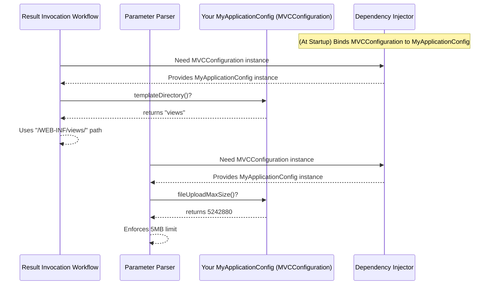

# Chapter 10: MVCConfiguration

Welcome to the final chapter of our Prime MVC tutorial! In [Chapter 9: Exception Handling (ErrorException / ExceptionHandler)](09_exception_handling__errorexception___exceptionhandler__.md), we learned how Prime MVC gracefully manages errors that might occur during request processing. Now, let's look at how we can fine-tune the framework itself.

Throughout this tutorial, we've seen various components like Action Mappers, Result Handlers, Security Schemes, and more. But how does the framework know *where* to find things like your template files? Or what the maximum allowed size for file uploads should be? Or the name of the cookie used for session messages? There needs to be a central place to define these rules and settings.

## The Problem: Fine-Tuning the Framework

Imagine Prime MVC is like a new appliance, maybe a smart oven. It comes with default settings that work well for most people. But perhaps you want to change the default cooking temperature, set a specific timer sound, or connect it to your home network differently. You wouldn't want to rewire the oven; you'd look for its settings panel.

Similarly, Prime MVC has many operational settings:
*   Where are the HTML template files located? (`/WEB-INF/templates/`?)
*   What's the biggest file a user can upload? (1MB? 10MB?)
*   Is Cross-Site Request Forgery (CSRF) protection enabled?
*   What should the cookie that stores flash messages be called?
*   What's the default error page to show?

We need a dedicated place to configure these behaviors without modifying the framework's core code.

## The Solution: MVCConfiguration - The Central Settings Panel

Prime MVC provides the **`MVCConfiguration`** interface for this exact purpose. Think of it as the **central settings panel** or the main **rulebook** for the framework. It defines methods that various parts of Prime MVC call to get configuration values.

You typically don't implement the `MVCConfiguration` interface directly from scratch. Instead, Prime MVC provides a convenient base class:

*   **`AbstractMVCConfiguration`**: This class provides sensible default values for most settings. To customize the framework, you usually **create your own class that extends `AbstractMVCConfiguration`** and override only the methods for the settings you want to change.

## How to Use: Customizing Your Settings

Let's say you want to change two things:
1.  Store your web page templates in a directory called `/WEB-INF/views/` instead of the default `/WEB-INF/templates/`.
2.  Increase the maximum allowed file upload size to 5 megabytes (5 * 1024 * 1024 bytes).

**Step 1: Create Your Configuration Class**

Create a new Java class that extends `AbstractMVCConfiguration`.

```java
// src/main/java/com/example/config/MyApplicationConfig.java
package com.example.config;

import java.nio.file.Path;
import java.security.Key;
import javax.crypto.spec.SecretKeySpec; // Import for Key example
import java.nio.file.Paths;           // Import for Path example

import org.primeframework.mvc.config.AbstractMVCConfiguration;

// Extend the abstract class
public class MyApplicationConfig extends AbstractMVCConfiguration {

  // 1. Override the template directory setting
  @Override
  public String templateDirectory() {
    // Return your custom directory name
    return "views"; // This is relative to WEB-INF
  }

  // 2. Override the max file upload size
  @Override
  public long fileUploadMaxSize() {
    // Return your desired size in bytes (5MB)
    return 5 * 1024 * 1024;
  }

  // --- IMPORTANT: You MUST implement these abstract methods ---
  // (AbstractMVCConfiguration leaves these for you to define)

  @Override
  public Path baseDirectory() {
    // Provide the base path of your web application content
    // This is often derived from the ServletContext in a real app
    // For example purposes, let's assume it's the current directory:
    return Paths.get("").toAbsolutePath(); // Adjust as needed!
  }

  @Override
  public Key cookieEncryptionKey() {
    // Provide a secret key for encrypting cookies (MUST be kept secure!)
    // Use a strong, persistent key in a real application.
    // Example using a hardcoded key (NOT recommended for production):
    byte[] keyBytes = "MySuperSecretKey12345678".getBytes(); // Use 16, 24, or 32 bytes for AES
    return new SecretKeySpec(keyBytes, "AES");
  }

  // --- Other methods inherit defaults from AbstractMVCConfiguration ---
  // For example, csrfEnabled() defaults to false unless you override it.
  // messageDirectory() defaults to "messages".
}
```

*   We extend `AbstractMVCConfiguration`.
*   We override `templateDirectory()` to return `"views"`.
*   We override `fileUploadMaxSize()` to return the byte value for 5MB.
*   We **must** also implement the `abstract` methods from the parent class: `baseDirectory()` (the root path of your web files) and `cookieEncryptionKey()` (a secret key used for securing cookies - **handle this securely in real apps!**).
*   All other settings (like `csrfEnabled`, `messageDirectory`, `localeCookieName`, etc.) will use the default values provided by `AbstractMVCConfiguration` unless you override them too.

**Step 2: Register Your Configuration**

Prime MVC needs to know that it should use *your* `MyApplicationConfig` class instead of the default settings. This is typically done using a Dependency Injection framework like Guice. You would "bind" the `MVCConfiguration` interface to your implementation in a Guice `Module`.

```java
// Simplified example of Guice binding
// (Usually in a class extending com.google.inject.AbstractModule)

// Inside your configure() method:
// bind(MVCConfiguration.class).to(MyApplicationConfig.class).in(Singleton.class);
```

This binding tells Guice, "Whenever any part of the Prime MVC framework asks for an `MVCConfiguration`, provide it with an instance of `MyApplicationConfig`".

**What Happens Now?**

*   When the [Result Invocation Workflow](03_result_handling__result___resultinvocationworkflow__.md) needs to render a template using a `ForwardResult`, it will ask the `MVCConfiguration` for the `templateDirectory()`. Because you registered `MyApplicationConfig`, it will receive `"views"` and look for templates in `/WEB-INF/views/`.
*   When the [Parameter Handling (ParameterWorkflow / ExpressionEvaluator)](05_parameter_handling__parameterworkflow___expressionevaluator__.md) processes a file upload, it will ask the `MVCConfiguration` for the `fileUploadMaxSize()`. It will receive `5242880` (5MB) and reject any files larger than that.

## Under the Hood: Consulting the Rulebook

How do different parts of the framework actually use these settings? They simply ask the `MVCConfiguration` instance (which they get via dependency injection).

Think of it like different departments in a company needing information:
1.  **Template Rendering Dept. (Result Invocation Workflow):** Needs to know where templates are stored. -> Asks `MVCConfiguration.templateDirectory()`.
2.  **File Intake Dept. (Parameter Parser):** Needs to know the maximum upload size. -> Asks `MVCConfiguration.fileUploadMaxSize()`.
3.  **Security Dept. (CSRF Handling):** Needs to know if CSRF protection is active. -> Asks `MVCConfiguration.csrfEnabled()`.
4.  **Mail Room (Flash Scope):** Needs the name for the message cookie. -> Asks `MVCConfiguration.messageFlashScopeCookieName()`.

Each component gets the specific setting it needs from the central configuration object when it needs it.

**Simplified Diagram:**



**Key Code Components:**

*   **`MVCConfiguration` Interface (`main/java/org/primeframework/mvc/config/MVCConfiguration.java`):** Defines all the available settings.

    ```java
    // Defines the contract for all configuration settings
    public interface MVCConfiguration {
      // Example methods:
      String templateDirectory();
      long fileUploadMaxSize();
      boolean csrfEnabled();
      String messageFlashScopeCookieName();
      Key cookieEncryptionKey(); // Required for cookie security
      Path baseDirectory();       // Required for base path context
      // ... many other settings ...
    }
    ```
    This interface lists all the questions that framework components can ask about configuration.

*   **`AbstractMVCConfiguration` (`main/java/org/primeframework/mvc/config/AbstractMVCConfiguration.java`):** Provides default implementations for most methods in `MVCConfiguration`.

    ```java
    // Provides default values, requires some methods to be implemented
    public abstract class AbstractMVCConfiguration implements MVCConfiguration {
      // Example defaults:
      public String templateDirectory = "templates";
      public long fileUploadMaxSize = 1024000; // Default 1MB
      public boolean csrfEnabled = false;
      public String messageFlashScopeCookieName = "prime-mvc-msg-flash";
      // ... other defaults ...

      // You override methods like this in your subclass:
      // @Override
      // public String templateDirectory() { return templateDirectory; }

      // You MUST implement these in your subclass:
      @Override
      public abstract Path baseDirectory();
      @Override
      public abstract Key cookieEncryptionKey();
    }
    ```
    This makes it easy to customize only what you need, while ensuring essential settings like the base path and encryption key are provided by the application.

*   **Example Usage in Framework Component (Simplified `DefaultParameterParser`):**

    ```java
    // Simplified snippet showing injection and usage
    public class DefaultParameterParser implements ParameterParser {
      private final MVCConfiguration configuration;
      private final HTTPRequest request;

      @Inject // Constructor injection
      public DefaultParameterParser(MVCConfiguration config, HTTPRequest req) {
        this.configuration = config;
        this.request = req;
      }

      @Override
      public Parameters parse() {
        // ... logic to handle request ...
        if (request.isMultipart()) {
          long maxSize = configuration.fileUploadMaxSize(); // Ask config!
          Set<String> allowedTypes = configuration.fileUploadAllowedTypes(); // Ask config!
          // ... use maxSize and allowedTypes when parsing file uploads ...
        }
        // ...
        return parsedParameters;
      }
    }
    ```
    Here, the `DefaultParameterParser` gets the `MVCConfiguration` instance via its constructor (thanks to Guice) and then calls methods like `fileUploadMaxSize()` to get the settings it needs to do its job correctly.

## Conclusion

Congratulations! You've reached the end of the Prime MVC tutorial. In this final chapter, you learned about the **`MVCConfiguration`** interface:

*   It acts as the **central settings panel** or **rulebook** for the framework.
*   It allows you to customize framework behavior like template locations, file upload limits, security settings, cookie names, and more.
*   You typically provide your application's settings by **extending `AbstractMVCConfiguration`** and overriding the specific methods you need to change.
*   This custom configuration class is then **registered** (usually via Guice) so that framework components can inject and use it to retrieve settings.

Understanding `MVCConfiguration` allows you to tailor Prime MVC precisely to the needs of your specific web application.

We hope this tutorial has given you a solid foundation for building applications with Prime MVC. You've journeyed from the basics of Actions and Results through Workflows, Parameter Handling, Scopes, Messages, Security, Exception Handling, and finally Configuration. Happy coding!

---

Generated by [AI Codebase Knowledge Builder](https://github.com/The-Pocket/Tutorial-Codebase-Knowledge)