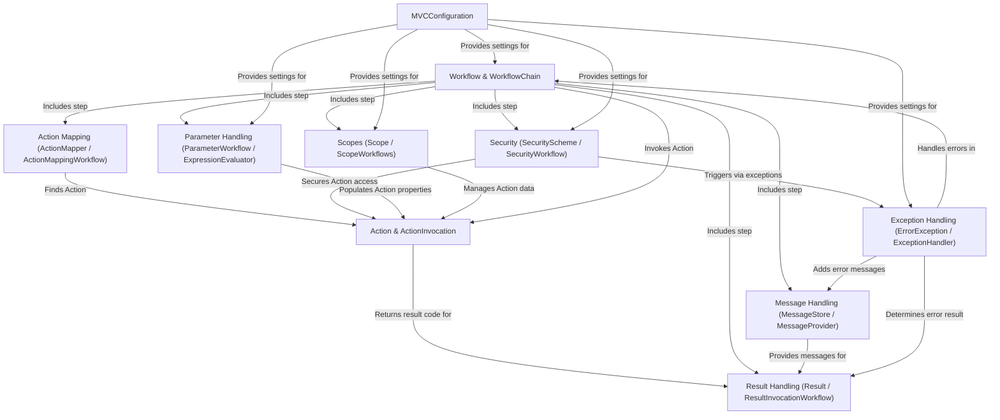

# Tutorial: prime mvc

This project is a **web framework** (Prime MVC) that helps developers build applications following the *Model-View-Controller* pattern.
It handles incoming web requests, routes them to the correct application logic (**Actions**), manages data (*Parameters*, *Scopes*), checks security, handles results (like showing a web page or returning data), and deals with errors and user messages.
The core request processing happens through a customizable **Workflow** chain.

**Source Repository:** [https://github.com/prime-framework/prime-mvc](https://github.com/prime-framework/prime-mvc)

## Chapters

1. [Action & ActionInvocation
](01_action___actioninvocation_.md)
2. [Action Mapping (ActionMapper / ActionMappingWorkflow)
](02_action_mapping__actionmapper___actionmappingworkflow__.md)
3. [Result Handling (Result / ResultInvocationWorkflow)
](03_result_handling__result___resultinvocationworkflow__.md)
4. [Workflow & WorkflowChain
](04_workflow___workflowchain_.md)
5. [Parameter Handling (ParameterWorkflow / ExpressionEvaluator)
](05_parameter_handling__parameterworkflow___expressionevaluator__.md)
6. [Scopes (Scope / ScopeWorkflows)
](06_scopes__scope___scopeworkflows__.md)
7. [Message Handling (MessageStore / MessageProvider)
](07_message_handling__messagestore___messageprovider__.md)
8. [Security (SecurityScheme / SecurityWorkflow)
](08_security__securityscheme___securityworkflow__.md)
9. [Exception Handling (ErrorException / ExceptionHandler)
](09_exception_handling__errorexception___exceptionhandler__.md)
10. [MVCConfiguration
](10_mvcconfiguration_.md)

---

Generated by [AI Codebase Knowledge Builder](https://github.com/The-Pocket/Tutorial-Codebase-Knowledge)
